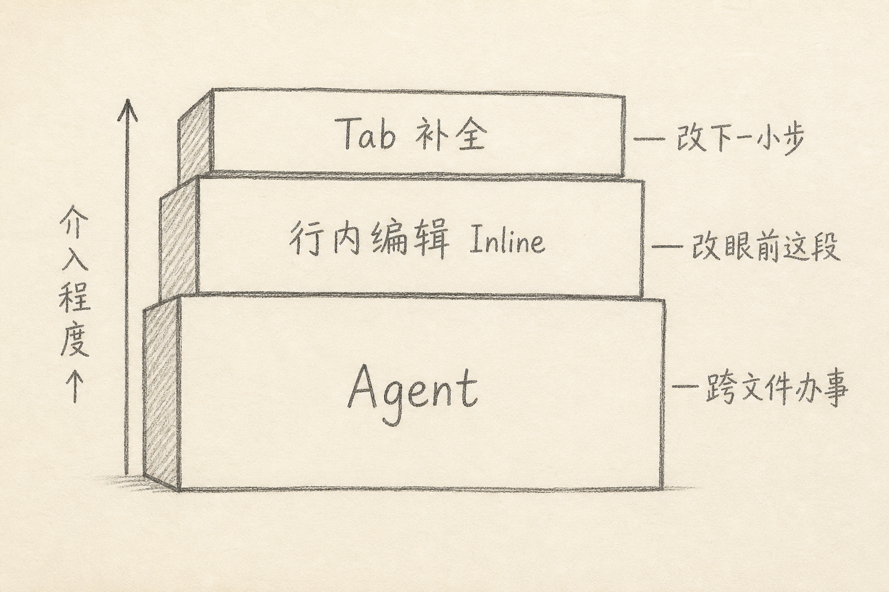
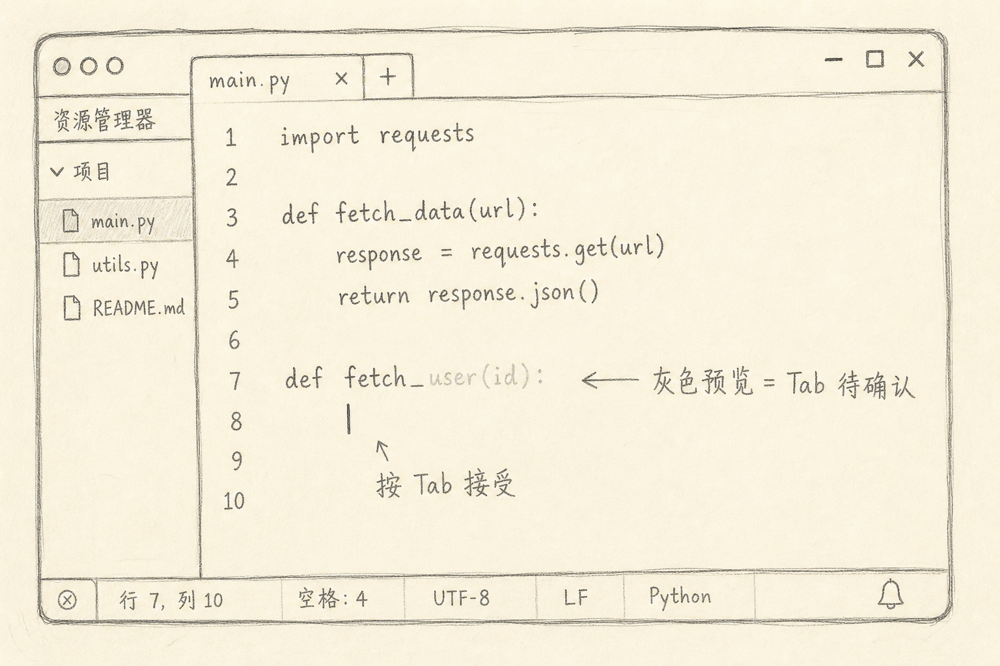
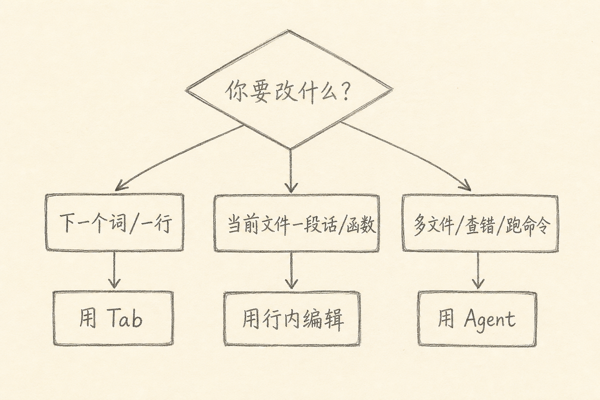

Cursor 是一款把代码补全、局部改写和代理式改仓库能力放在同一编辑器里的产品。

上手后最常见的困惑不是「会不会提问」，而是：眼前这件事，该按 Tab、开行内编辑，还是丢给 Agent？三种入口都能改代码，边界却不一样。混用的代价是：简单改动被 Agent 改得太宽，复杂任务却在 Tab 里一点点啃，又慢又碎。

下面按「介入程度」说明三者分别干什么，以及怎么选。快捷键以常见默认值为例，你本机若改过键位，以设置里的为准。



## 一、先建立一个选择标准

写代码时，我通常先问自己三句话：

（1）改动范围是「下一个词」，还是「眼前这一段」，还是「好几个文件」？  
（2）我是否已经想清楚目标，只差落笔；还是还需要探索、搜索、跑命令？  
（3）我是否希望逐步确认每一处改动，还是可以先看一整包 diff？

答案会把你推向不同入口。简单说：范围越小、目标越清楚，越适合轻量入口；范围越大、步骤越多，越适合 Agent。

## 二、Tab：接下一小步

Tab 补全（以及同源的「下一处编辑」建议）适合你已经在写、模型只负责续写或补上紧邻改动的场景。

典型画面是：你打了半行，编辑器里出现灰色预览；按 Tab 接受，继续往下写。它像副驾驶帮你踩油门，方向盘仍在你手上。



适合：

（1）补全函数签名、导入、重复样板  
（2）按已有风格把相似代码写完  
（3）小步重构时，接受「下一处同类修改」的建议

不太适合：

（1）需求还没想清楚，指望 Tab「悟」出架构  
（2）要改很多文件、跑测试、查文档才能定案的任务  
（3）需要强约束输出格式，却没有在上下文里写清楚的场合

使用上有两个习惯很有用。

第一，接受前先扫一眼灰色预览。Tab 很快，错接受也很快；错一次，后面建议可能沿错误方向继续漂。

第二，用有信息量的前缀引导它。与其停在空行干等，不如先写下意图明确的名字或注释。

下面是一个最小示例：先写出目标函数名，再让补全跟上。

```ts
// 从 users 里按 id 查找，找不到返回 null
export function findUserById(
```

上面代码中，函数名和注释已经把「查找 / 按 id / 可能为空」说清楚了。Tab 此时续写参数与函数体，通常比从空白行猜更稳。

## 三、行内编辑：改眼前这段

行内编辑（常见默认：`Cmd+K` / `Ctrl+K`）面向「选中一块代码，用一句话改它」。

它比 Tab 更明确：你划定范围，写出指令，模型主要在这个范围内给补丁。像把这段代码拎到小黑板前，只讨论这一段怎么改。

适合：

（1）给函数加参数、改错误处理、补日志  
（2）把一段逻辑从回调改成 async/await  
（3）按注释或类型错误，局部重写实现

不太适合：

（1）改动必须同步落到测试、配置、另一个包  
（2）你还不知道改哪一段，需要先全局搜索  
（3）指令含糊到「优化一下」「写漂亮一点」——结果常飘

写指令时，尽量同时给出**约束**和**验收**。

下面是一个对比。

弱指令：

```text
优化这个函数
```

强一点的指令：

```text
把下面函数改为异步：用 fetch 拉 /api/users/:id。
失败时抛出带 status 的 Error；找不到用户返回 null。
不要改函数名，不要新增依赖。
```

上面两段里，第二段说明了数据来源、失败行为、空值语义，以及「不改名 / 不加依赖」。行内编辑最怕形容词，最吃可检查的条件。

操作节奏可以固定成四步：

（A）选中最小相关代码（宁小勿大）  
（B）写清目标、边界、不要做什么  
（C）看 diff，只接受需要的部分  
（D）立刻跑一下类型检查或相关测试（若项目里有）

选区过大时，模型容易「顺手」改到无关分支。选区过小时，它又缺少类型与调用约定。一般以「一个函数或一个完整代码块」为默认单位，再按需要加减。

## 四、Agent：跨文件办事

Agent（以及同类的多文件代理对话）适合目标明确、但步骤跨文件的活：搜索、改多处、创建文件、跑命令、根据报错再改。

它像你把一张工单交给同事：同事可以在仓库里走动，不只站在你光标旁边。

适合：

（1）「给这个模块补测试，并修好因此暴露的类型错误」  
（2）「查清这个 API 在哪些地方被调用，统一改参数」  
（3）「按现有目录结构新增一个小功能，并接上路由」

不太适合：

（1）只改一行、只补全半个表达式——杀鸡用牛刀，还可能扩散改动  
（2）需求本身摇摆：「先随便做做看」容易得到一堆难回滚的中间态  
（3）你不打算看 diff 就合并——Agent 越能干，越需要审查

给 Agent 下单，我习惯用同一模板：

```text
目标：……
范围：只动 apps/foo 下与用户列表相关的文件
不要做：不改数据库 schema；不升级依赖
验收：pnpm --filter foo typecheck 通过；列表空态有单测
```

上面模板中，「范围」和「不要做」比形容词重要；「验收」让你（和 Agent）知道何时停手。没有验收条件，Agent 很容易一直改到你疲倦为止。

## 五、一张决策图

把前面收成一张图：



日常可以记三条口诀：

（1）手还在键盘上、下一小步已知 → Tab  
（2）这段我能圈出来、一句话能说清 → 行内编辑  
（3）要找、要跑、要改多处 → Agent

三条都拿不准时，先用行内编辑试最小切口。能在一个函数里解决，就不要先开 Agent；一个函数里解决不了，再升级。

## 六、三种方式如何配合

真实工作流很少只用一种。

常见组合是：

（1）Agent 搭骨架或做跨文件串联  
（2）行内编辑打磨关键函数  
（3）Tab 把重复样板写完

也可以反过来：你先用 Tab 和行内编辑摸清局部形状，再让 Agent 按既定模式扩散到其余文件。扩散前，最好已经有一段「样板实现」和一句「其余地方按这个模式改」的说明。

无论哪种组合，审查点是一样的：diff 是否超出范围、公开 API 是否被悄悄改掉、测试是否真的覆盖你关心的行为。

## 七、常见误区

（1）**凡事先开 Agent**  
上下文更贵，改动面更大，回滚成本更高。小改动用重工具，往往更慢。

（2）**Tab 连按不看预览**  
速度会骗过审查。错误补全一旦写入，后续建议可能继续错下去。

（3）**行内编辑只写「重构」「优化」**  
模型缺少可执行标准时，会改风格、改命名、改控制流，却不一定改你真正在意的问题。

（4）**把聊天当唯一上下文**  
三种入口都吃当前文件、选区、仓库规则与打开的标签页等信息。关键约束写进规则文件或指令正文，比指望「它应该记得上次说的」更稳。

（5）**忽略本机键位与模式名称可能变更**  
产品迭代快，按钮文案会变。稳定的是心智模型：续写、局部改写、代理办事。入口叫什么，以你当前版本界面为准。

## 八、小结

Tab 管「下一小步」，行内编辑管「眼前这段」，Agent 管「跨文件的一张工单」。

先选范围，再选入口；先写清约束与验收，再追求快。会选，比会问长提示更重要。

（完）
