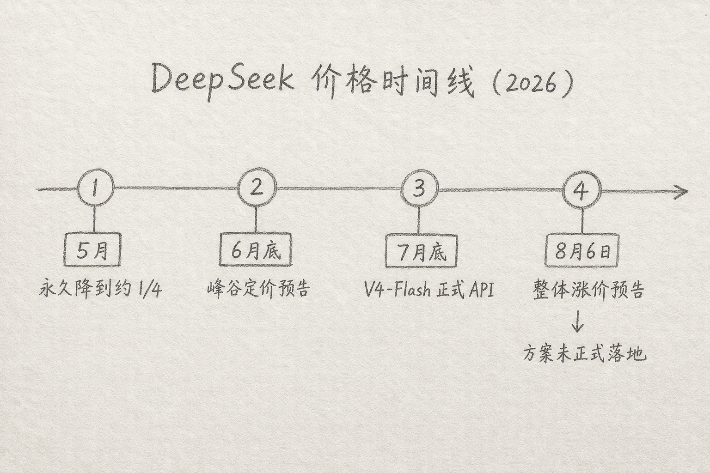
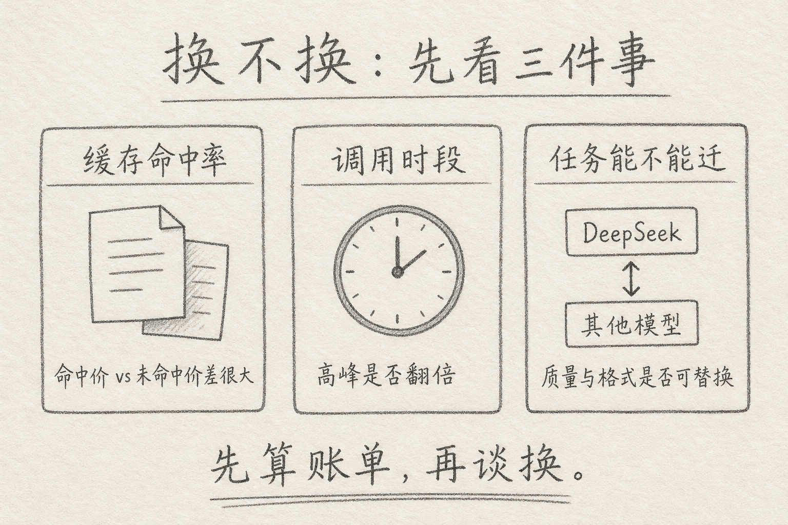

2026 年 8 月 6 日，DeepSeek 在开放平台发公告：计划近期**整体上调** API 定价，并写明「预计涨幅较大」，具体方案以正式通知为准。

这和「高峰翻倍」不是同一件事。前者动的是基准价；后者是同一基准价上，按北京时间工作日时段再乘系数。消息一出，开发者群里最常见的一句话，不是「涨多少」，而是：**你换了吗？**

下面按我自己做选型时的顺序整理：先弄清发生了什么，再决定要不要迁。



## 一、先说一个具体麻烦

你有一条已经跑顺的链路：Agent / 编码助手 / 批处理，都打在 `deepseek-v4-flash` 或 `deepseek-v4-pro` 上。账单还能看，延迟也能忍。

然后同一周里出现两种信息：

（1）调用量榜单上 DeepSeek 很靠前，容量告急的传闻也有  
（2）官方说整体涨价，幅度可能不小，但新价表还没贴出来

麻烦在于：你不知道自己该不该连夜改 `base_url`。改早了，可能只是空转；不改，正式生效那天账单可能突然难看。

所以问题不是「DeepSeek 还会不会便宜」，而是：**你的用法，对「基准价上调」敏感不敏感**。

## 二、发生了什么：降价战之后的回调预告

把 2026 年上半年到 8 月初的动作压成一条线，大致是：

（A）4～5 月：打折、再把优惠落成更低的正式价（常见说法是落到原价约四分之一）  
（B）6 月底：预告 V4 正式版，并引入峰谷定价——工作日高峰时段价格翻倍  
（C）7 月底前后：`deepseek-v4-flash` 正式版 API 公测上线，性价比叙事继续  
（D）8 月 6 日：公告「整体上调」「涨幅较大」，正式细则未发

公告原文的核心很短：整体上调、涨幅较大、请合理安排使用、以正式通知为准。本文写稿时（8 月中旬），公开渠道仍宜把「新价表」当成**待落地**，不要把媒体推演的数字当成已生效牌价。

峰谷机制若仍在生效，常见描述是：北京时间工作日 **9:00–12:00**、**14:00–18:00** 为高峰，对应计费项按平时价 **2 倍**；夜间、周末、节假日走平峰。是否与「整体上调」叠加、会不会改时段，只能等正式方案。

现行公开价（涨价方案落地前的基准，单位：元 / 百万 tokens）可记个数量级：

| 模型              | 输入（缓存命中） | 输入（缓存未命中） | 输出 |
| ----------------- | ---------------- | ------------------ | ---- |
| deepseek-v4-flash | 0.02             | 1                  | 2    |
| deepseek-v4-pro   | 0.025            | 3                  | 6    |

上面表里，真正刺眼的不是「0.02 看起来多便宜」，而是**命中与未命中差几十倍**。涨价若按比例抬升，最先疼的是每一轮都把大段上下文重传、几乎不命中缓存的那批用法。

## 三、核心思路：先问「你的账单结构」，再问「换谁」

简单说，API 涨价像水电公司改电价：你要不要搬家，取决于你家是不是「白天大功率电器全开」，而不是邻居群里谁先骂两句。

所谓「要不要换」，通常拆成三件事。



### 3.1 缓存命中率

DeepSeek 的输入价按缓存命中 / 未命中分档。系统提示、工具定义、长前缀如果每次都变，命中率上不去，你实际付的是「未命中档」。

这类用户对「整体涨价」最敏感。反过来，前缀稳、命中率高的流水线，绝对增幅可能小很多——前提是新方案仍保留类似分档。

### 3.2 调用时段

若峰谷仍在，工作日白天的同步聊天、在线 Agent，天然站在高峰一侧。批处理、评测、夜间流水线，更吃平峰。

「换模型」不一定是最优解。有时把可延迟任务挪到平峰，比换一家更省事。

### 3.3 任务能不能迁

换模型要同时过三关：

（1）质量：你的难例集还过不过  
（2）格式：JSON / 工具调用 / 思考字段是否兼容  
（3）工程：`base_url`、密钥、限流、日志是否一天内改得完

DeepSeek 文档写明兼容 OpenAI / Anthropic 形态调用，迁移协议成本往往不高。真正贵的是**质量回归**：编码 Agent、长上下文检索、带工具的多步任务，不能只拿「写个问候」当验收。

## 四、一个最小决策流程

我自己会按这个顺序走，而不是先改默认模型。

（1）打开账单或用量面板，看输入命中率、高峰时段占比、Flash / Pro 分流  
（2）用你现有的 10～30 条难例，在候选模型上各跑一遍（通过率、轮次、费用）  
（3）只把「可延迟」的流量挪平峰或降档到 Flash；在线主路径先不动  
（4）正式价表出来后，用「新价 × 你的真实用量结构」重算月账单  
（5）若增幅可接受，留下；若不可接受，再切主路径，并保留一键回滚

下面是一个只换接入点的示意（字段以你当天文档为准）。

```bash
curl https://api.deepseek.com/chat/completions \
  -H "Content-Type: application/json" \
  -H "Authorization: Bearer ${DEEPSEEK_API_KEY}" \
  -d '{
    "model": "deepseek-v4-flash",
    "messages": [
      {"role": "system", "content": "You are a helpful assistant."},
      {"role": "user", "content": "用三句话说明缓存命中为什么影响账单"}
    ],
    "stream": false
  }'
```

上面代码中，模型名仍是文档里的 `deepseek-v4-flash` / `deepseek-v4-pro`；涨价动的是计费，不一定改调用方式。真要换家，通常是改 `base_url`、密钥和模型 id，然后跑同一套难例。

## 五、常见误区

（1）**把「涨价预告」当成「已经按新价扣费」**  
预告和正式通知之间，仍以当前公开价与账单为准。

（2）**只盯百万 tokens 牌价，不看自己的命中率**  
牌价便宜、用法很「未命中」，账单照样贵；反过来亦然。

（3）**高峰翻倍和整体上调混成一件事**  
一个是时段系数，一个是基准价。两者可能叠加，也可能改结构，以正式方案为准。

（4）**涨价当天全量切走，不做回归**  
协议兼容不等于任务兼容。Agent 链路最怕「能聊、不能干活」。

（5）**以为只有 DeepSeek 在动价格**  
2026 年国内多家模型服务都在用订阅、阶梯、限流、停售新用户等方式管产能。低价换规模不是永久稳态。

## 六、小结

DeepSeek 这次消息的要点是：在经历过大幅降价与峰谷机制之后，官方预告**整体上调 API 价，且幅度可能较大**；正式数字要等通知。

「你换了吗」没有统一答案。缓存差、白天同步量大、难例在别家也能过的人，更值得准备迁移。命中率高、任务绑得紧、账单里 DeepSeek 占比本就不高的人，可以先优化时段与前缀，等价表落地再算。

我自己的默认动作是：**先量结构，再备选模型，最后才改默认**。涨价新闻适合当压力测试，不适合当情绪开关。

（完）
