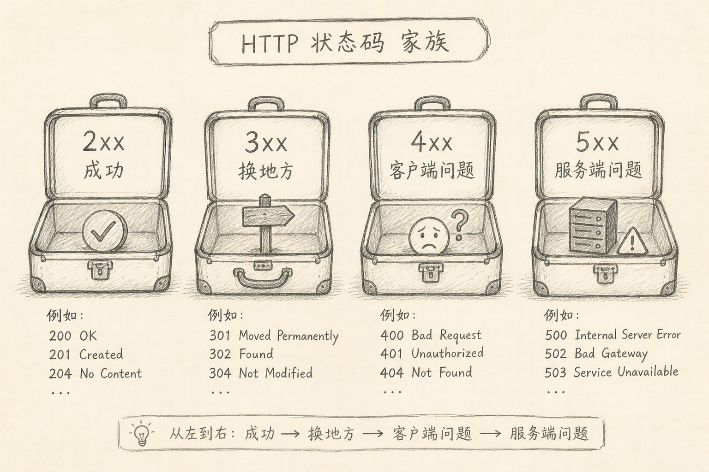
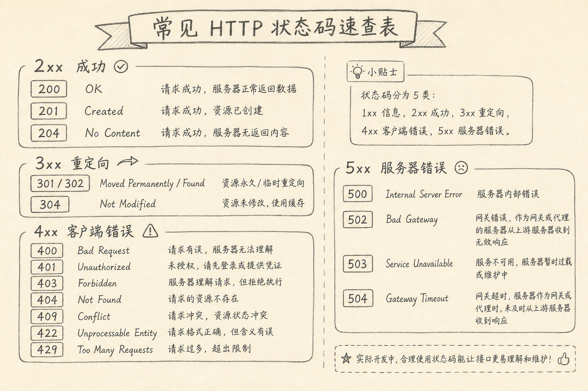

HTTP 状态码（status code）是服务器对一次请求给出的三位数结果标签：成功、换地方、客户端有问题，还是服务端有问题。

完整表很长，考试可以背，上班用不上那么多。真正拖慢排障的，往往是：看见 `401` 和 `403` 分不清，或把 `502` 当成业务错误去改前端文案。

下面只收日常高频的那些，并说明「该谁处理」。



## 一、先记住四个百位

状态码的第一位数字，比后两位更重要。

（1）**2xx**：请求被成功处理（至少在协议语义上）  
（2）**3xx**：要去别处拿，或用缓存  
（3）**4xx**：请求方有问题（参数、权限、路径、频率等）  
（4）**5xx**：服务方或网关链路有问题

排障时先看百位，能迅速决定：是改请求，还是查服务，还是跟缓存 / 重定向较劲。

## 二、2xx：成功时常用哪几个

### 200 OK

最常见。GET 到了内容，PUT/PATCH 改成功且响应体里带回结果，很多 API 也用 200。

### 201 Created

创建资源成功。POST 新建用户、新建订单时很常见。响应里常带新资源或 `Location`。

### 204 No Content

成功了，但没有响应体。DELETE 成功、或「已接受但无需正文」时会用。前端要注意：别假定一定有 JSON 可解析。

这三者够覆盖大半「成功」场景。`202 Accepted`（已接受、异步处理中）在任务队列场景会见到，知道含义即可。

## 三、3xx：换地方与缓存

### 301 / 302

重定向。`301` 更偏永久搬家，`302` 更偏临时。浏览器和爬虫行为细节不少，业务上你先记住：响应头里的 `Location` 才是下一个地址。

### 304 Not Modified

协商缓存命中：资源没变，用本地缓存即可。这不是错误。

前端开发时若「接口突然没 body」，先看是不是 304，再看自己是否正确处理缓存头。

## 四、4xx：先查请求方

### 400 Bad Request

请求不合格：JSON 坏了、缺字段、类型不对。修请求或校验提示。

### 401 Unauthorized

未认证或认证失效。简单说：你还没证明「你是谁」，或证明过期了。该去登录、刷新令牌，而不是改业务权限文案。

### 403 Forbidden

已认证，但没有权限。简单说：我知道你是谁，但不许做这件事。

`401` 与 `403` 是最值得分清的一对。

### 404 Not Found

路径或资源不存在。可能是 URL 写错，也可能是资源已删除。对 API 设计，有人用 404 表示「业务上找不到」，需看项目约定。

### 409 Conflict

冲突：版本不对、重复创建、状态机不允许该操作。乐观锁失败常见这个。

### 422 Unprocessable Entity

语义上懂你的请求，但业务校验不过（例如邮箱格式对，但已被占用的规则更复杂时，有的 API 用 422）。与 400 的边界因项目而异；对接时以接口文档为准。

### 429 Too Many Requests

被限流。该退避重试，而不是立刻换参数狂刷。

## 五、5xx：先查服务与网关

### 500 Internal Server Error

服务内部未处理异常。该看服务端日志，不是先怪浏览器。

### 502 Bad Gateway

网关 / 代理上游收到无效响应。常是上游挂了、协议不对、连接被掐。

### 503 Service Unavailable

服务暂时不可用：维护、过载、主动熔断。可重试，但要有间隔与上限。

### 504 Gateway Timeout

网关等上游超时。查上游耗时、超时配置、是否慢查询，而不是只加大前端 `fetch` 等待。



## 六、前后端各自怎么用

### 6.1 写接口时

（1）成功用 2xx，并稳定一种风格（创建用 201 还是 200，项目内统一）  
（2）鉴权失败用 401，权限不足用 403，别混  
（3）校验失败用 400 或 422，响应体里给出可展示的错误信息  
（4）别把所有错误都打成 500；未捕获异常才是 500

下面是一个最小响应示例。

```http
HTTP/1.1 401 Unauthorized
Content-Type: application/json

{"error":"token_expired","message":"请重新登录"}
```

上面代码中，状态码告诉客户端「认证层失败」；body 告诉产品文案怎么写。两者分工，不要只靠 body 里的 `code: 200` 假装成功。

### 6.2 写前端时

（1）先分支百位，再处理具体码  
（2）401：走刷新令牌或登录态清理  
（3）403：展示无权限，不要当成未登录死循环跳转  
（4）429 / 503 / 504：有限次退避，避免雪崩  
（5）502 / 500：给可重试与报错入口，把 `request id` 留下

下面是一个极简分支示意。

```ts
if (res.status === 401) return refreshOrLogin();
if (res.status === 403) return showForbidden();
if (res.status === 429) return retryAfter(res.headers.get("Retry-After"));
if (res.status >= 500) return showServerError();
```

上面代码中，401 与 403 分开；5xx 合并展示可以，但日志里仍应记下具体状态码。

## 七、常见误区

（1）**业务失败也返回 200，只在 JSON 里写 `success: false`**  
能跑，但缓存、监控、客户端中间件都会变难。新项目尽量用状态码表达协议层结果。

（2）**看见 404 就只查前端路由**  
API 的 404 与页面路由 404 不是同一层。先分清是文档站、SPA 路由，还是接口路径。

（3）**401 / 403 混用**  
会导致「有权限的用户被踢去登录」或「未登录用户看到无权限」。

（4）**把 502 / 504 当业务异常提示给用户「参数错误」**  
文案误导，排障更慢。

（5）**背冷门码却分不清百位**  
`418` 可以当梗，排障时 4xx / 5xx 的分流更要紧。

## 八、小结

日常够用的集合其实不大：

- 2xx：`200` `201` `204`
- 3xx：`301`/`302` `304`
- 4xx：`400` `401` `403` `404` `409` `422` `429`
- 5xx：`500` `502` `503` `504`

先看百位，再看这一小撮常用码，并分清「改请求」还是「查服务」。完整表留给搜索，工作台只留会用到的。

（完）
