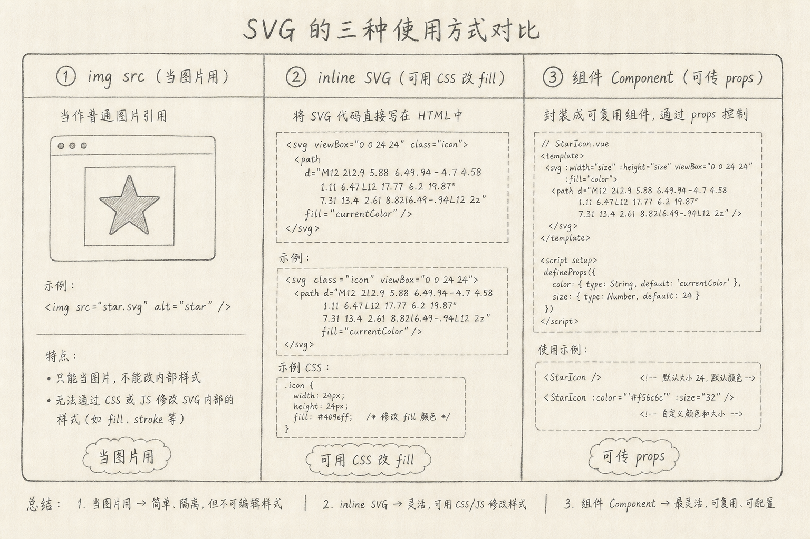
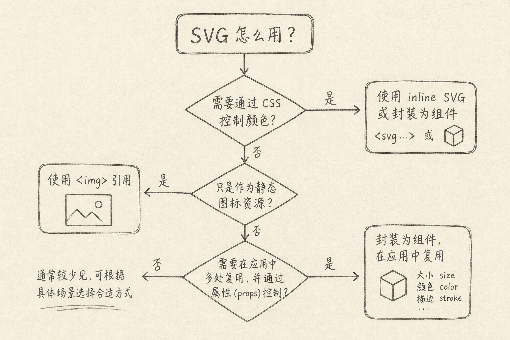

SVG（Scalable Vector Graphics，可缩放矢量图形）是用 XML 描述的矢量图，放大仍保持清晰，适合图标与简单插画。

前端项目里，同一份 SVG 常有三种用法：当图片用、写进 HTML/JSX、包成组件。选错时会出现：颜色改不动、包体积变大、或每个页面复制一大段 path。

下面把三种用法拆开，并给出怎么选。



## 一、先说一个具体麻烦

设计给了一个 `logo.svg`。你随手写成：

```html

```

上面代码中，SVG 被当成普通图片引用。多数情况下这没问题：缓存友好，写法简单。

接着产品说：「暗色模式下 logo 要改成浅色。」你写了 `img { fill: #fff }`，发现没用。因为以 `img` 引入时，外部 CSS 通常改不了 SVG 内部的 `fill`。

于是有人改成整段内联 SVG，颜色能改了，但每个页面粘贴上百行 path，维护又变痛。第三种做法是：做成组件，把 `color` 当 prop 传进去。

三种方式都对，只是解决问题不同。

## 二、用法一：当作图片（img 或 CSS background）

把 SVG 当静态资源，和 PNG 类似。

适合：

（1）颜色固定、不需要运行时改 fill / stroke  
（2）只要清晰缩放与小体积  
（3）希望浏览器按普通图片缓存

不太适合：

（1）要随主题切换颜色  
（2）要精细控制内部某个 path 的动画或交互  
（3）需要从外层 CSS 穿透修改图形属性

补充：`background-image: url(...svg)` 与 `img` 类似，外部 CSS 同样难改内部 fill。可用 CSS mask 做单色图标技巧，但那是另一条路，本文先按三种主用法讲。

## 三、用法二：内联 SVG

把 `<svg>...</svg>` 直接写进 HTML 或 JSX。

适合：

（1）要用 CSS 改 `fill` / `stroke` / `currentColor`  
（2）要对内部节点做动画或悬停态  
（3）图标少、改动频繁的关键视觉元素

不太适合：

（1）大量重复内联导致 JSX 嘈杂  
（2）同一图标在几十处复制粘贴  
（3）设计师频繁换稿，你却在改多份拷贝

下面是一个最小内联示例。

```html
<svg width="24" height="24" viewBox="0 0 24 24" aria-hidden="true">
  <path fill="currentColor" d="M12 2a10 10 0 1 0 0 20 10 10 0 0 0 0-20z" />
</svg>
```

上面代码中，`fill="currentColor"` 让图标颜色跟随文字颜色。父级改 `color`，图标跟着变，这是内联相对 `img` 的关键优势。

无障碍上：装饰性图标可 `aria-hidden="true"`；有意义的图形要有可访问名称（例如 `role="img"` + `<title>`，或由旁白文字说明）。

## 四、用法三：做成组件

在 React / Vue 等框架里，把 SVG 封装成组件，通过 props 控制尺寸、颜色、标题。

适合：

（1）设计系统里的图标集  
（2）多处复用，且要统一 API（`size` / `color` / `className`）  
（3）既要可改样式，又不想到处粘贴 path

不太适合：

（1）只用一次的大插画（可能直接内联或当图更简单）  
（2）完全不需要样式控制的静态资源（`img` 更轻）

下面是一个最小 React 示意。

```tsx
type IconProps = {
  size?: number;
  className?: string;
  title?: string;
};

export function CircleIcon({ size = 24, className, title }: IconProps) {
  return (
    <svg
      width={size}
      height={size}
      viewBox="0 0 24 24"
      className={className}
      role={title ? "img" : undefined}
      aria-hidden={title ? undefined : true}
    >
      {title ? <title>{title}</title> : null}
      <path fill="currentColor" d="M12 2a10 10 0 1 0 0 20 10 10 0 0 0 0-20z" />
    </svg>
  );
}
```

上面代码中，尺寸与无障碍属性变成稳定 API；颜色继续走 `currentColor` 或外部 class。路径只维护一份。

工程上还可以用 SVGR 等工具，把 `.svg` 文件编译成组件，避免手贴 path。那是工具链细节，心智模型仍是「第三种用法」。

## 五、怎么选

可以按决策树走：

（1）颜色与内部样式都不用改 → 优先 `img`（或背景图）  
（2）要改颜色 / 做简单交互，且出现次数少 → 内联  
（3）多处复用、要统一 props → 组件



补充两条经验：

（1）**logo 常两套**：默认用 `img` 保证缓存与简单；若强依赖主题色，再提供组件版或内联版  
（2）**图标集走组件**：设计系统里不要一半 img 一半内联，API 不统一会拖慢所有人

## 六、性能与包体注意点

（1）内联与组件会把路径打进 JS/HTML；图标极多时，注意打包体积与缓存粒度  
（2）`img` 可独立缓存、可懒加载，适合大装饰图  
（3）无论哪种方式，导出前用 SVGO 一类工具清理无用元数据，能明显缩小 path  
（4）不要为了「全矢量」把照片级复杂度的图硬转 SVG

## 七、常见误区

（1）**以为所有 SVG 都能用 CSS 改 fill**  
只有进入 DOM 的内联/组件版通常可以；`img` 不行（常规情况）。

（2）**把几十份内联复制粘贴当组件**  
改一处漏十九处，是维护事故。

（3）**忽略 viewBox**  
只有宽高、没有正确 `viewBox`，缩放与裁剪会怪。

（4）**装饰图标不处理无障碍**  
要么隐藏，要么给名称，避免读屏读出一堆 path 噪音。

（5）**用 SVG 替换本该用字体或系统控件的地方**  
按钮、焦点态、语义，仍要落在 HTML 控件上；SVG 负责图形，不负责整套交互语义。

## 八、小结

前端用 SVG，常见三条路：

（1）`img`：当图片，简单可缓存，难改内部样式  
（2）内联：进 DOM，好调色与动画，怕复制粘贴  
（3）组件：可复用、可传参，适合图标系统

先问「要不要改样式、要不要复用」，再选用法。选对了，暗色模式改个颜色不会变成半天排障。

（完）
