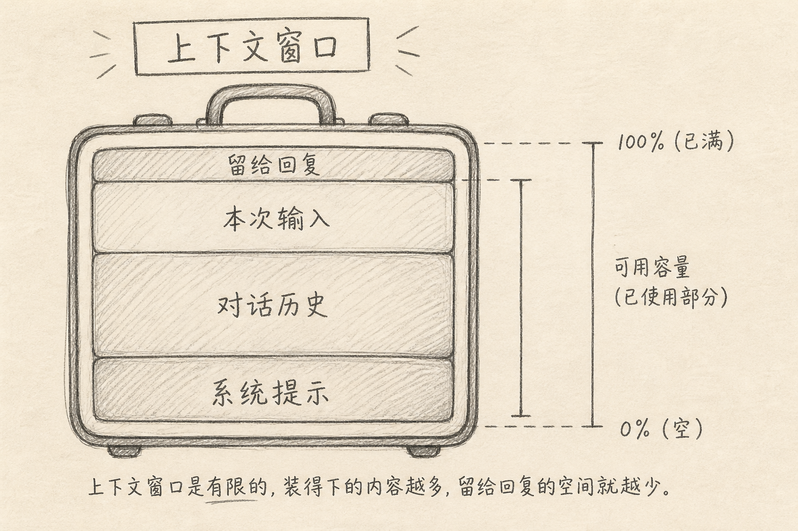
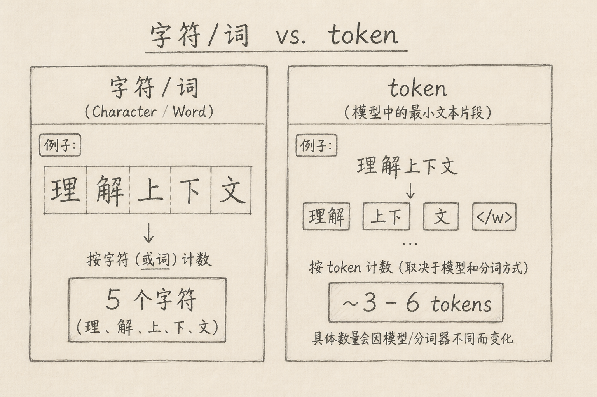
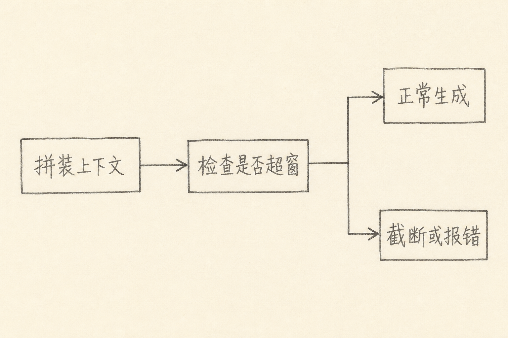

上下文窗口（context window）是大模型一次推理时，能同时装进「输入侧」的内容上限。

聊天一长、提示一复杂，就会撞到这个上限：模型忘了开头、工具报错 `context length exceeded`，或者回复突然变短。术语多，数字也不统一，读完仍常不清楚「到底在限制什么」。

下面是我的整理：先讲具体麻烦，再讲 token 与窗口，最后落到日常怎么用。



## 一、先说一个具体麻烦

假设你在做一个长对话助手。

前二十轮都很顺。到第三十轮，你提到「还是用第一节那个接口名」。模型却答非所问，像从没见过那一节。

再换一种情况：你把整份仓库文档贴进提示，接口直接返回错误，提示上下文超长。

这两种现象，背后往往是同一件事：模型并不是无限记得整段聊天。它每次生成，主要依赖**这一次请求里放进去的内容**。放不下的，要么被裁掉，要么根本发不出去。

所谓上下文窗口，指的就是这块「一次能带上的材料」的容量上限。

## 二、核心思路：窗口是容量，不是永久记忆

简单说，上下文窗口更像一块有限的桌面，而不是无限硬盘。

你可以这样想：出差只能带一个固定尺寸的行李箱。衣服、证件、电脑充电器都要塞进去。塞满了，再想加一件，就得先拿出别的，或者换更大的箱子。

映射回模型：

（1）行李箱容量 ≈ 上下文窗口大小（通常用 token 计量）  
（2）衣服、证件 ≈ 系统提示、历史消息、检索片段、工具返回  
（3）还要留一点空位给「回程」≈ 模型生成回复也要占预算（具体规则因厂商而异）

不难看出：窗口限制的不是「模型懂不懂」，而是「这一次它能同时看见多少」。

很多人说的「模型失忆」，常常只是旧内容已经挤出窗外，并不是参数被抹掉了。

## 三、token 到底是什么

要理解窗口数字，先要理解计量单位：token。

token 不是字符，也不完全是「一个英文单词」。它是分词器（tokenizer）切出来的小块文本。英文常见是词根、词缀；中文常见是字、词或更碎的片段。同一句话，不同模型的分词器，切法可能不同，token 数也会不同。



举例来说，「理解上下文」按字符数是 5。按 token 数，可能是大约 3～6，取决于模型。英文 `understanding` 可能是 1 个 token，也可能被拆成几段。

因此：

（1）用「字数 / 页数」估算窗口，只能当粗略感觉  
（2）真正撞上限时，以接口返回的 usage、或官方 tokenizer 为准  
（3）换模型时，同样一段中文，占用可能明显变化

下面是一个最小示例，用来感受「什么会被计数」。

```json
{
  "messages": [
    { "role": "system", "content": "你是简洁的助手。" },
    { "role": "user", "content": "用一句话解释上下文窗口。" },
    { "role": "assistant", "content": "它是模型一次能看见的文本容量上限。" },
    { "role": "user", "content": "那 token 呢？" }
  ]
}
```

上面代码中，四条消息都会进入本次请求的上下文。系统提示、历史问答、最新问题，通常都算进输入侧；模型接下来生成的答案，往往算输出侧。两边怎么共享上限，要看具体产品文档。

## 四、窗口里通常装了什么

一次典型的对话请求，窗口里往往不止「你刚打的那句话」。

常见占用大致是：

（1）系统提示（角色、规则、输出格式）  
（2）对话历史（多轮 user / assistant）  
（3）本次用户输入（问题、粘贴的代码、日志）  
（4）检索或工具结果（RAG 片段、函数返回、网页摘要）  
（5）留给模型生成的空间（max tokens / 输出预算）

聊天产品还会在后台塞入日期、安全策略、工具说明等「隐形提示」。你看不见，但它们同样占窗。

所以，界面上写着「支持 128K」，不等于你能随手贴 128K 纯正文。系统与工具说明会先吃掉一块；若还要长回复，输出预算再吃一块。

## 五、token 到底在限制什么

把前面串起来，token 限制的是这些事：

### 5.1 一次请求的可见范围

模型生成第 N 个词时，主要依据窗口内已有内容。窗外的旧消息，默认不参与本次推理。

### 5.2 输入与输出如何抢预算

不少产品把「输入 + 输出」放在同一总上限下约束；也有产品对输入、输出分别设硬顶。表现上都是：输入塞太满，回复空间变小，或直接拒绝请求。

### 5.3 成本与延迟

按 token 计费时，窗口越大、塞得越满，费用越高。超长上下文还会带来更慢的首 token 与更长的处理时间。容量是能力，也是账单和等待。

### 5.4 超窗之后会发生什么

不同产品策略不同，常见有三类：

（A）直接报错，要求你缩短内容  
（B）自动截断更早的历史，保留最近几轮  
（C）先摘要再塞回窗口（有的客户端会做）

自动截断省事，但「第一节那个接口名」可能正好被裁掉。这就是开头那个麻烦的来源。



## 六、实践上怎么用

### 6.1 先分清三个数字

看模型卡片时，我通常先找这三项：

（1）上下文窗口总大小（如 8K / 32K / 128K）  
（2）最大输出长度（若单独给出）  
（3）官方是否说明「输入与输出共享」

只看第一个营销数字，容易高估可用正文量。

### 6.2 长任务不要只靠「把历史堆满」

窗口再大，也不是无限备忘录。更稳的做法是：

（1）把稳定规则放进系统提示，保持短而硬  
（2）长文档用检索，只塞相关片段，而不是全文粘贴  
（3）多轮任务定期让模型总结「已确认事实」，用摘要替换流水账历史  
（4）需要精确原文时，把关键段落单独贴进本轮，并写明「以上为准」

### 6.3 用 usage 校准直觉

很多 Chat Completions 响里会返回 usage 字段。下面是一个简化例子。

```json
{
  "usage": {
    "prompt_tokens": 1820,
    "completion_tokens": 240,
    "total_tokens": 2060
  }
}
```

上面代码中，`prompt_tokens` 接近「这次送进去的内容」；`completion_tokens` 是生成长度；`total_tokens` 多为两者之和。多跑几次自己的典型提示，你会很快建立「这段中文大概吃多少」的手感，比死记换算表有用。

### 6.4 中文场景多留余量

中文分词更碎时，同样「看起来不长」的段落，token 可能高于直觉。粘贴日志、堆栈、Base64、表格时尤其明显。工程上我习惯按「预估再加 20%～30% 余量」安排，而不是卡着上限填满。

## 七、常见误区

（1）**把上下文窗口当成长期记忆**  
窗口是单次可见范围。跨会话、跨设备的「记住用户」，要另做存储与召回，不能指望纯聊天历史永远在窗内。

（2）**用字数直接当 token 数**  
中英混排、代码、标点，都会让换算失真。以 tokenizer 或 usage 为准。

（3）**以为越大窗口就一定越好**  
更大窗口能装更多材料，也会带来更高费用、更长延迟，以及「噪音更多、重点更糊」的风险。相关的短上下文，常常优于无关的长上下文。

（4）**忽略系统提示与工具说明的占用**  
Agent / 带工具的对话，隐形说明可能很长。可用正文比标称窗口更小。

（5）**超窗后只怪模型「变笨」**  
先检查是否历史被截断、检索是否没命中、关键约束是否还在窗内。很多「变笨」是材料没带上。

## 八、小结

上下文窗口，是模型一次推理能同时看见的内容容量。  
token，是计量这块容量的尺子，不是字符，也不等于单词。

它真正限制的是：你能带上哪些提示与历史、还能留多少给回复，以及随之而来的费用与延迟。它不直接等于「模型有多聪明」，也不等于「永远记得你说过的每一句」。

以后再看到 32K、128K、1M，可以先问三句：计量单位是不是 token？输入输出是否共享？我的系统提示和工具说明已经占了多少？

问清这三句，数字就不再只是广告参数。

（完）
