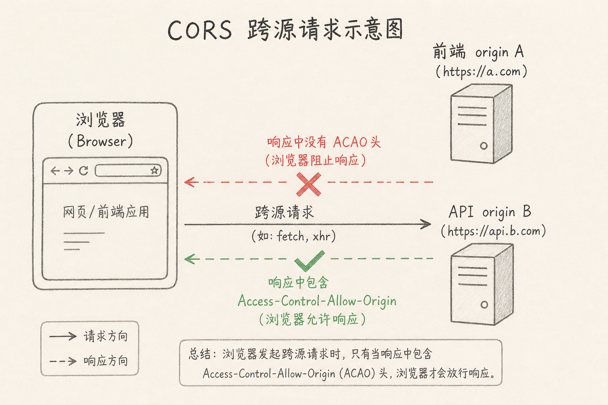
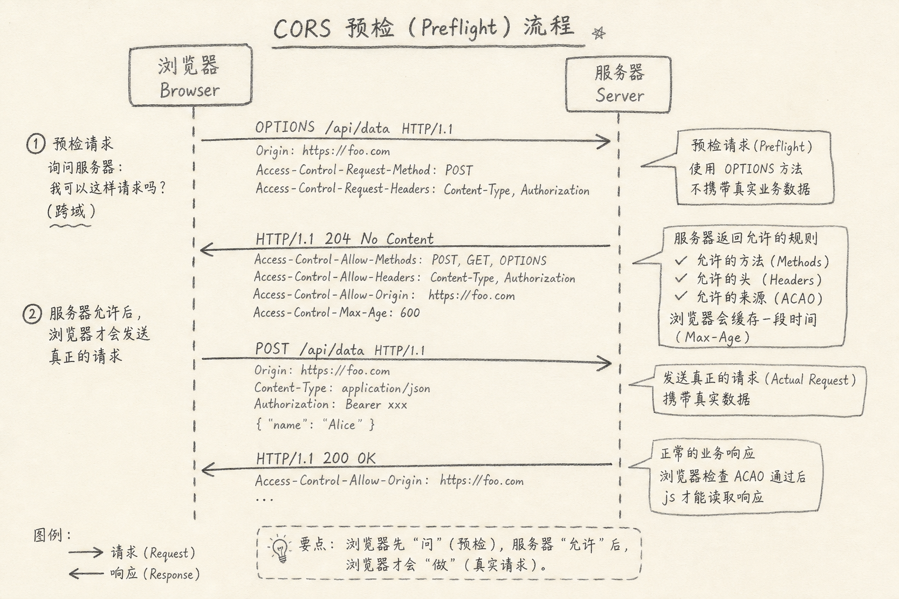
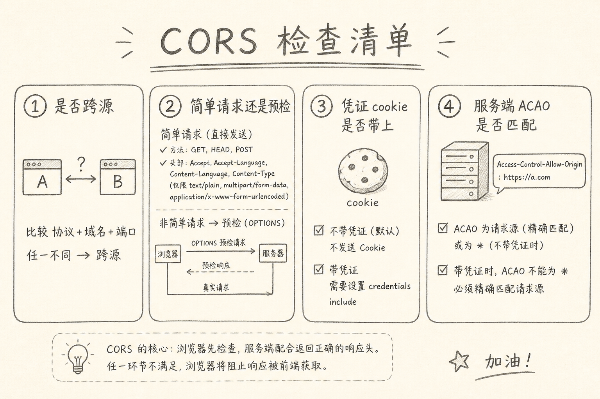

CORS（Cross-Origin Resource Sharing，跨源资源共享）是浏览器的一套规则：页面所在源与接口所在源不同时，是否允许前端脚本读取这次响应。

控制台里最常见的红字之一，就是某请求被 CORS 策略挡住。很多人一看到就改前端 `fetch` 乱加 header，或随手把服务端改成 `Access-Control-Allow-Origin: *`。症状能暂时消失，根因却没弄清。

下面按「浏览器在防什么 → 什么算跨源 → 简单请求与预检 → 怎么正确放行」说明。



## 一、先说一个具体麻烦

页面在 `https://app.example.com`，接口在 `https://api.example.com`。

用 `fetch` 调接口，Network 面板里请求可能已经到了服务器，甚至返回了 200。但前端代码读不到 body，控制台报 CORS error。

这让人很困惑：服务器明明成功了，为什么还算失败？

因为 CORS 主要约束的是**浏览器里的前端脚本能不能读取跨源响应**，不是禁止服务器处理请求。curl、服务端对服务端调用，通常不受这套规则限制。

## 二、核心思路：同源才默认信任

浏览器默认假定：不同源的网站不应随便读你的接口结果。否则任意恶意页都可能拿着你的登录态，去别的站拉数据。

所谓源（origin），通常由三部分组成：协议、主机、端口。任一不同，就是跨源。

举例来说：

（1）`https://example.com` 与 `https://api.example.com` → 跨源（主机不同）  
（2）`http://example.com` 与 `https://example.com` → 跨源（协议不同）  
（3）`https://example.com` 与 `https://example.com:8443` → 跨源（端口不同）  
（4）`https://example.com` 与 `https://example.com/app` → 同源（路径不算进源）

CORS 就是跨源时的「通行证」协议：服务端用响应头声明「我允许哪个源的前端读我」。

## 三、谁在拦，拦的是什么

记住三句，排障会快很多。

（1）拦的是**浏览器中的前端 JS 读取**，不是 TCP 一定发不出去  
（2）很多「简单请求」会先发出去；若响应缺允许头，JS 仍读失败  
（3）「非简单请求」会先发 OPTIONS 预检；预检不过，正式请求可能根本不发

所以：不要只看 Network 有没有 200，还要看响应头是否包含合适的 `Access-Control-Allow-Origin` 等字段，以及控制台的 CORS 原文。

## 四、简单请求与预检

### 4.1 简单请求（大致直觉）

方法是 GET / HEAD / POST，且头集合比较「朴素」（例如普通 `Content-Type` 为 `application/x-www-form-urlencoded`、`multipart/form-data`、`text/plain` 等）。细节以规范为准，日常记住：一旦加了自定义头、或 JSON 的 `Content-Type: application/json`，常常就不再「简单」。

### 4.2 预检（preflight）

浏览器先发 `OPTIONS`，询问：允不允许这个源、用这个方法、带这些头来访问？

服务端需要用响应头回答，常见包括：

（1）`Access-Control-Allow-Origin`  
（2）`Access-Control-Allow-Methods`  
（3）`Access-Control-Allow-Headers`  
（4）可选：`Access-Control-Max-Age`（预检缓存多久）



下面是一个预检响应的示意。

```http
HTTP/1.1 204 No Content
Access-Control-Allow-Origin: https://app.example.com
Access-Control-Allow-Methods: GET, POST, PUT, DELETE
Access-Control-Allow-Headers: Content-Type, Authorization
Access-Control-Max-Age: 7200
```

上面代码中，允许源必须对得上你的前端页；方法和自定义头要覆盖真实请求。少写一个自定义头，预检就会失败。

## 五、带 Cookie 时更严

若前端要带上 cookie（`credentials: 'include'`），服务端不能再用 `Access-Control-Allow-Origin: *`，必须回显具体源，并加上：

```http
Access-Control-Allow-Credentials: true
```

同时前端也要显式开 credentials。三边任一不一致，表现为「登录态带不上」或继续 CORS 报错。

下面是前端侧最小示例。

```js
await fetch("https://api.example.com/me", {
  method: "GET",
  credentials: "include",
});
```

上面代码中，`credentials: 'include'` 要求服务端按「具体源 + Allow-Credentials」放行；只改前端、不改服务端头，解决不了。

## 六、排障清单

我按这个顺序查：

（1）是否真的跨源？（看协议 / 主机 / 端口）  
（2）失败发生在预检还是正式请求？（看有没有 OPTIONS）  
（3）`Allow-Origin` 是 `*` 还是具体源？是否匹配当前页？  
（4）是否带凭证？头组合是否合法？  
（5）自定义头 / 方法是否出现在 `Allow-Headers` / `Allow-Methods`？  
（6）网关、CDN、反向代理有没有把 OPTIONS 或 CORS 头吃掉？



本地开发常见做法是：开发服务器代理到 API（同源相对路径），生产再由网关统一加 CORS。这样能减少「本地一套、线上一套」的混乱，但生产仍要明确允许哪些源。

## 七、常见误区

（1）**以为 CORS 是服务器防火墙**  
服务器可能已 200；是浏览器不让 JS 读。

（2）**前端用插件「关掉 CORS」当修复**  
那只是改了你自己的浏览器，用户环境不会跟着改。

（3）**生产环境长期 `Allow-Origin: *` 且还带 cookie**  
规范不允许这种组合；即使绕过，安全模型也被挖空。

（4）**只配了正式请求头，忘了 OPTIONS**  
预检死在网关上，正式业务代码永远触达不到。

（5）**把鉴权错误当成 CORS**  
401/403 与 CORS 失败不同。先分清控制台文案是 CORS 还是 HTTP 状态问题。

## 八、小结

CORS 是浏览器在跨源时，要求服务端明确授权前端脚本读取响应的机制。

它拦的是「前端能不能读」，不是「服务器能不能算」。修好它，靠的是源判断、预检头、凭证规则对齐，而不是在前端玄学地多加几个 header。

下次再看见红字，先问：跨源了吗？预检过了吗？Allow-Origin 写对了吗？

（完）
