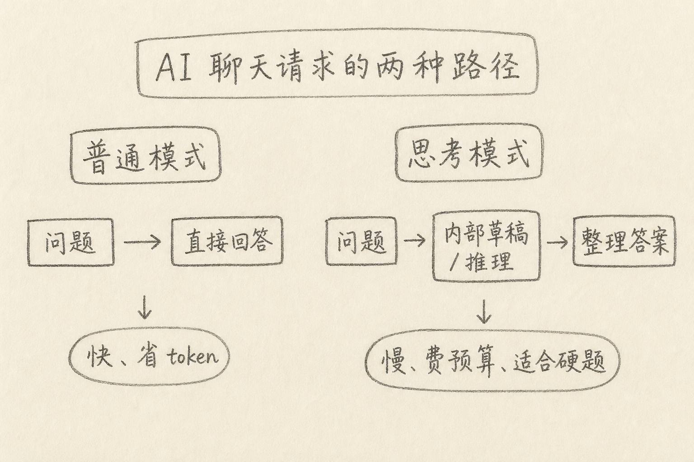
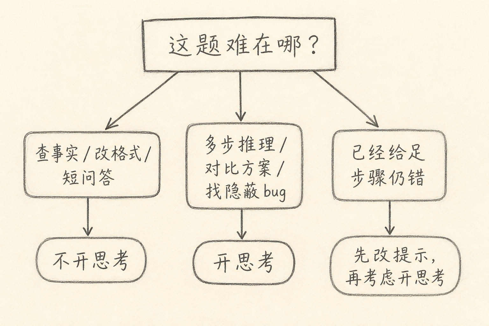

「思考模式」（也常叫推理模式、extended thinking 一类名字）是让模型在给出最终答案前，先多做一段内部推理或草稿演算的开关。

同一道题，关掉它往往更快、更省；打开它有时更准，但更慢、更费配额。产品文案爱说「更深思考」，却很少讲清：多出来的那截预算，到底适合买什么。

下面整理我实际选用的标准：它在干什么、什么时候值得开、什么时候开了也救不了。



## 一、先说一个具体麻烦

你让模型做两件事。

第一件：把一段 JSON 改成表格，字段名已经写死。  
第二件：根据三份互相打架的日志，判断是网关超时、上游 500，还是客户端重试风暴。

第一件用普通模式通常就够。第二件若一步答错，你会想：「是不是该开思考模式？」

有时开了确实更好。有时开了只是更慢，结论照样漂——因为缺的是关键日志片段，不是「想得不够久」。

所以问题不是「思考模式强不强」，而是：**这题的瓶颈，是不是多步推理**。

## 二、核心思路：多买一轮草稿纸

简单说，思考模式像考试时允许先打草稿，再誊到答卷上。

普通模式更像口头快答：看到题就写结论。  
思考模式则多留一段「只给自己看」的推理过程（界面上可能折叠、摘要，或不展示全文），再收敛成最终回复。

映射到成本，大致是：

（1）延迟变长：先推理，后作答  
（2）token / 配额更贵：内部草稿也要算进用量（具体计费以各产品为准）  
（3）换来的是：多步拆解、自检、对比方案的空间

它不是另一套百科全书，而是**同一类模型能力，换了一种更慢的解题节奏**。

## 三、它真正帮得上的题型

我倾向于在这些场景打开：

（1）**多步推理**：数学推导、状态机、权限组合、复杂条件分支  
（2）**方案对比**：两三种实现各有代价，需要列出取舍再选  
（3）**隐蔽 bug**：症状在 A，根因可能在 B；需要交叉验证假设  
（4）**长约束任务**：输出要同时满足格式、边界、反例，一步生成容易漏

不太倾向于默认打开的场景：

（1）查定义、改语气、翻译、简单格式转换  
（2）你已经把步骤写死，模型只是填空  
（3）主要瓶颈是缺材料（没贴报错、没贴相关代码），而不是推理深度  
（4）要低延迟的补全、短问答、聊天式头脑风暴第一轮

一句话：难题若卡在「想清楚」，开；卡在「信息不够」，先补材料。



## 四、和「把提示写清楚」是什么关系

很多人一遇到错答，先拨开关。更稳的顺序常常是：

（A）补齐输入：报错全文、相关文件、期望与实际  
（B）写清约束与验收：不要什么、怎样算对  
（C）仍不稳，再开思考模式  
（D）还不行，拆成子问题，或换工具（跑测试、查文档）

下面是一个对比。

弱提示 + 指望思考模式：

```text
这段代码有时会挂，帮我看看。
```

强提示，即使先不开思考也可能够用：

```text
下面是接口超时的客户端日志与网关 access log（已粘贴）。
请给出最可能的 2 个根因，每个根因对应一条日志证据；
不要建议「再加点重试」除非能说明为何不是上游 5xx。
```

上面两段里，第二段已经要求「证据」和「排除项」。思考模式能帮模型把证据链走完，但替代不了你把日志贴进来。

## 五、怎么判断「开了有没有用」

可以用很土的 A/B：

（1）同一道题，关 / 开各跑一次（注意温度等设置尽量一致）  
（2）只看你事先写好的验收条件，不看文笔  
（3）若准确率差不多，保留更快、更省的那个

再补两条体感：

（1）若普通模式已经稳定正确，开思考多半是浪费  
（2）若普通模式错在「跳步、漏约束」，思考模式更可能帮忙；若错在「胡编不存在的 API」，优先查文档或给官方片段，而不是只加推理时间

产品若提供「思考预算 / 强度」档位，不必一上来拉满。先中档，不够再加。

## 六、常见误区

（1）**把思考模式当成智商升级包**  
它主要买的是解题步骤与自检时间，不是自动拥有更新的世界知识。

（2）**所有对话默认常开**  
短任务会被拖慢，费用上升，体感变差，却不一定更准。

（3）**以为展开的「思考过程」都可信**  
界面展示的推理摘要可能经过改写；最终仍以答案与可验证结果为准。

（4）**用思考模式掩盖提示含糊**  
「帮我优化一下架构」开再久，也缺少验收。先把目标写清楚。

（5）**忽略任务可并行拆分**  
有时三个小问题分别问，比一个大问题开满思考更稳、更好审查。

## 七、小结

思考模式，是在最终答案前多留一轮草稿纸：更慢、更费，换多步推理与自检的空间。

该开的时候：题难在推理、对比、交叉验证。  
不该迷信的时候：题难在缺材料、缺约束，或本身只是短平快改写。

先问「瓶颈是不是想不清楚」，再拨开关，通常比凡事拉满更划算。

（完）
