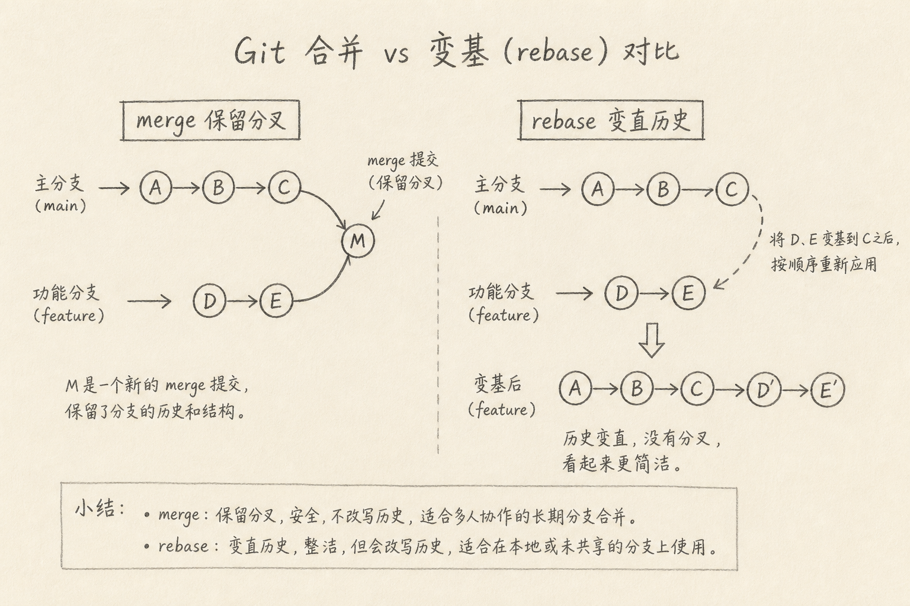
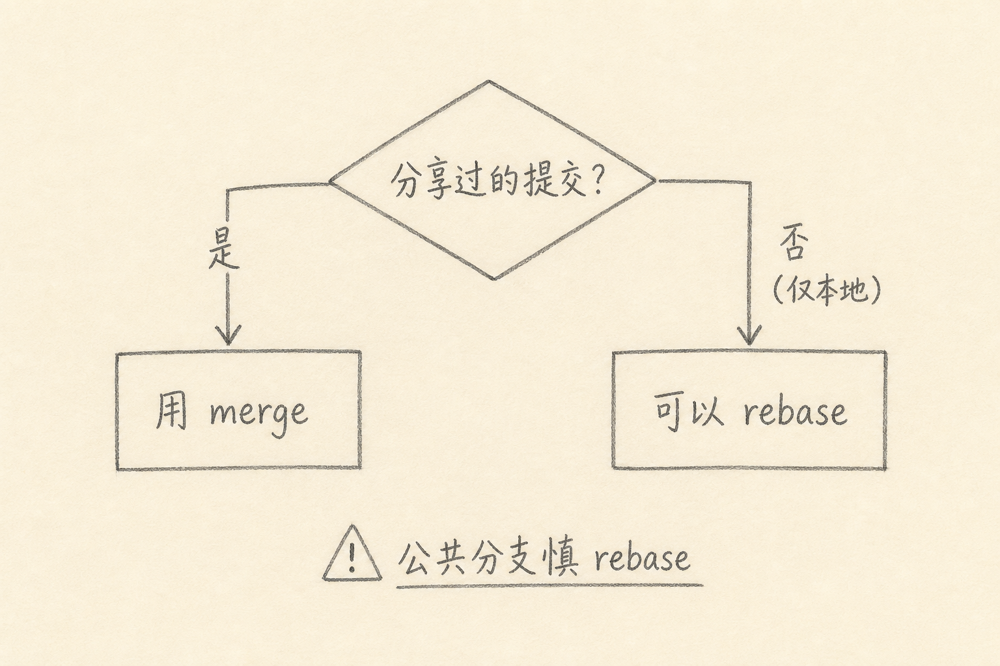

merge 与 rebase 都是把「一条线上的新提交」合进「另一条线」的手段，但它们改写历史的方式不同。

团队里最常见的争论是：该 merge 还是该 rebase？争论背后往往不是品味，而是两件事没分开：**要不要保留分叉痕迹**，以及**这些提交有没有已经被人拉走过**。

下面先讲各自解决什么问题，再讲怎么选。



## 一、先说一个具体麻烦

你从 `main` 拉出 `feature`，做了三个提交。与此同时，`main` 上又多了别人的两个提交。

现在要把功能合回去。你会遇到两种「干净」的幻想：

（1）历史里能看出「曾经分叉又汇合」  
（2）历史看起来像一条直线，仿佛你一直基于最新 `main` 开发

merge 更接近前者，rebase 更接近后者。两者都能让代码合在一起，但仓库历史长得不一样，后续出问题时的可读性也不一样。

## 二、merge：保留「汇合」这件事

`git merge` 把两条历史接在一起。若不能快进（fast-forward），通常会产生一个合并提交（merge commit），父母有两个：一边是你的分支，一边是目标分支。

它解决的问题是：

（1）**如实记录并行开发**：谁何时分叉、何时合入，图上看得见  
（2）**不改写已有提交的哈希**（在普通 merge 场景下）：对已经推送分享过的历史更安全  
（3）**冲突集中处理一次**：在合并那一刻解决

代价是：

（1）历史可能出现较多汇合节点，图更「茂盛」  
（2）若团队不喜欢 merge commit，需要额外约定（如允许 fast-forward only）

下面是一个最小示例。

```bash
git checkout main
git pull
git merge feature
```

上面代码中，若双方都有独有提交，Git 可能创建一个 merge commit。`feature` 上的原提交哈希一般保持不变。

## 三、rebase：把提交「挪到新基地上重放」

`git rebase` 把你的提交拿起来，按顺序在另一个基地（常是更新后的 `main`）上重新应用。结果常常是一条更直的历史。

它解决的问题是：

（1）**让功能分支基于最新主干**，减少「我基于过时 main 开发」的漂移  
（2）**历史更线性**，`git log` 读起来像故事而不是树丛  
（3）合入前整理：揉提交、改说明（常配合 interactive rebase）

代价是：

（1）**重写提交哈希**：重放后的提交不是原来的那些对象  
（2）若别人已经基于你的旧提交工作，强推会让协作混乱  
（3）冲突可能在「重放每一个提交」时反复出现

下面是一个最小示例。

```bash
git checkout feature
git fetch origin
git rebase origin/main
```

上面代码中，`feature` 上的提交被接到最新 `origin/main` 后面。看起来整洁，但本地原提交已被新提交替代。

## 四、一张选择图

核心判断只有一句：**这些提交是否已经分享给别人、并可能被别人当作基地？**

（1）只在自己电脑上的分支 → rebase 通常安全，也常更干净  
（2）已经 push 到共享远程、别人可能拉过 → 优先 merge；若必须 rebase，需要团队明确约定并协调  
（3）受保护的主干（`main` / `master`）→ 不要 rebase 公共历史



很多团队的折中是：

（1）功能分支日常：对 `main` 做 rebase，保持分支新  
（2）合入主干：用 merge（或平台上的 merge / squash merge 策略）  
（3）禁止对已共享历史私自 `push --force`

## 五、和 squash 的关系

平台上的「Squash and merge」会把功能分支多个提交压成主干上的一个提交。它既不是经典 merge 图，也不是简单 rebase，而是**合入时改写呈现方式**。

它解决的是：主干只要「一个功能点一个提交」，细节留在 PR 讨论里。

代价是：分支上的细粒度提交不会原样进入主干。对回溯「哪一行何时引入」有时不够细，但主干更干净。选不选 squash，是团队规范问题，不必道德化。

## 六、冲突时心态

merge 冲突：发生在汇合点，一次处理「两边最终差异」。  
rebase 冲突：可能在重放路径上多次停下，每次处理「该提交相对新基地」的差异。

若功能分支很长、与主干分叉很久，rebase 可能更痛苦。这时不一定要硬 rebase；merge 一次、或先把大分支拆小，往往更省命。

## 七、常见误区

（1）**把 rebase 当成「更高级的 merge」**  
它们目标不同，没有绝对高下。

（2）**在公共分支上 rebase 后强推**  
这是协作事故的常见来源。

（3）**为了直线历史，无视可追溯性**  
直线好看，但有时 merge commit 能解释「为何同一天两条线」。

（4）**冲突时随意 `git rebase --skip`**  
跳过等于丢掉该提交的改动，需非常确定。

（5）**忽略钩子与 CI 对「强制推送」的保护**  
仓库规则在保护你，不是故意刁难。

## 八、小结

merge 解决的是：把分叉历史诚实汇合，尽量不改写已分享的提交。  
rebase 解决的是：把本地（或约定可改写的）提交挪到新基地上，换一条更直的故事线。

先问「提交有没有被人用过」，再选命令。会选，比争论哪一个「更正确」有用。

（完）
