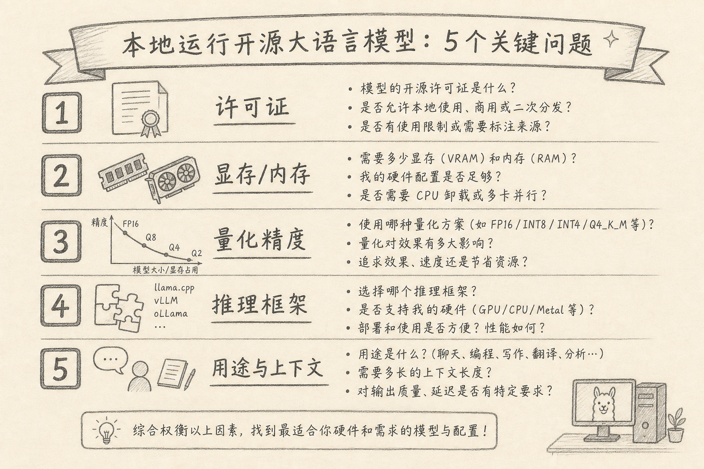
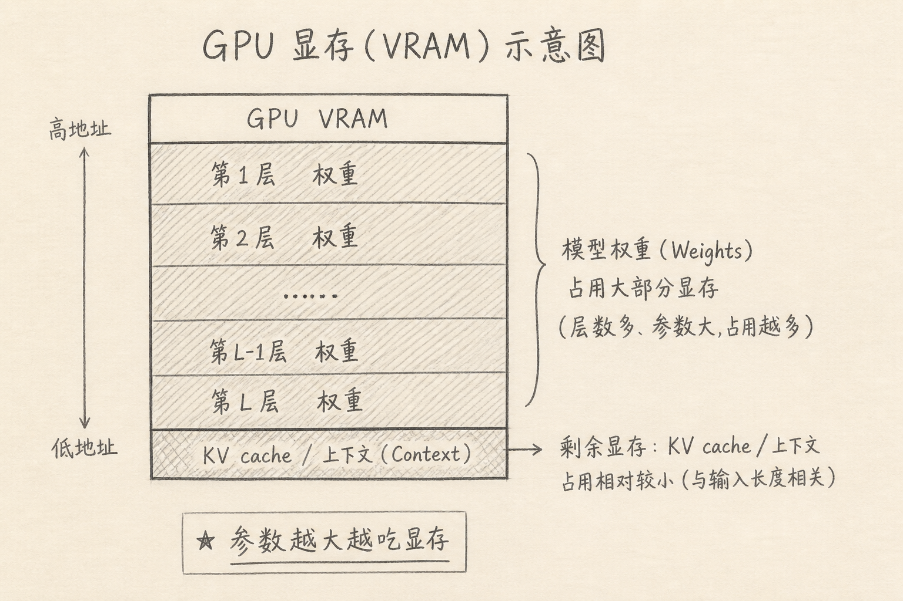

把开源模型权重下载到本地跑，听起来自由：数据不出机房，也能脱离按 token 计费。

真正卡人的很少是「会不会敲命令」，而是下完几十 GB 才发现：许可证不能商用、显存不够、上下文开太短、或框架与显卡对不上。

下面五个问题，建议在点下载之前就问完。



## 一、许可证允许你怎么用？

开源模型的「开源」口径并不统一。权重、代码、训练数据可能各有协议。

先看清楚：

（1）是否允许商用  
（2）是否要求署名、是否限制调用方产品形态  
（3）合并进你的服务对外提供时，有没有额外条款  
（4）输出内容是否有使用限制（较少见，但要扫一眼说明）

个人学习与公司产品，答案可能不同。许可证不合格，后面的技术问题都白做。

## 二、显存 / 内存够不够？

参数量大致决定权重体积，但运行时还要留给 KV cache、激活值、框架开销。

粗直觉（非常粗，仅供建立数量级）：

（1）同等精度下，参数越多，权重越占显存  
（2）上下文越长，KV cache 越吃显存  
（3）显存不够时，可能落到系统内存 / 磁盘卸载，速度会断崖式变慢



实操建议：

（1）先查模型卡上的参数量与推荐配置  
（2）按你的 GPU 显存留余量，不要按「刚好装下权重」卡死  
（3）CPU-only 能跑不等于能用；先定义可接受的 token/s

问不清显存，就先别追最大参数。

## 三、要用什么精度 / 量化？

同样一个 70B，FP16、8bit、4bit 量化后的体积与质量不同。

需要权衡：

（1）质量：量化越狠，越省显存，越可能伤效果  
（2）速度：取决于内核、硬件与实现，不是单调关系  
（3）格式：GGUF、GPTQ、AWQ 等与推理引擎绑定

选型顺序我习惯是：先定「任务能不能接受的质量下限」，再选能塞进显存的最高精度；而不是先下 4bit，发现不行再反复重下。

## 四、推理框架与硬件是否匹配？

常见路线包括（名称会随时间变，以你当下生态为准）：

（1）面向本地聊天的一体客户端  
（2）llama.cpp 一类偏 CPU / 消费级显卡友好的路径  
（3）vLLM、TGI 一类偏服务化吞吐的路径  
（4）各家原厂或社区的 CUDA / ROCm / Metal 后端

开跑前确认：

（1）显卡架构是否被支持（驱动、CUDA 版本）  
（2）你要的量化格式是否被该框架读取  
（3）要不要 OpenAI 兼容 API，方便接现有工具  
（4）许可与遥测：有的客户端默认联网，内网场景要关掉

框架选错，表现为：装得上、载得进、一推理就崩，或慢到不可用。

## 五、用途、上下文与成功标准是什么？

「能聊天」和「能当同事」不是同一目标。先写清：

（1）用途：补全代码、内网知识问答、批量摘要、还是实验玩票  
（2）上下文：文档问答需要多长窗口，是否要 RAG  
（3）并发：单人本地，还是小团队同时打 API  
（4）验收：延迟、正确率、能否离线、日志是否落盘

没有验收标准，就会陷入无尽换模型。有了标准，才能决定「小模型 + RAG」是否优于「硬上大参数」。

下面是一个给自己看的最小清单示例。

```text
用途：内网文档问答（不接外网）
硬件：24GB 显存
上下文：检索 Top-5 片段，模型窗口 >= 8K
许可证：允许商用
验收：常见问题准确率可接受；首 token < 2s；全程可离线
```

上面清单中，每一行都能否决某个候选模型。比先下载再后悔便宜。

## 六、五个问题怎么串起来

建议顺序：

（A）许可证  
（B）用途与验收  
（C）显存与上下文  
（D）量化档位  
（E）框架与驱动

许可证与用途不合格，直接停。硬件与框架不匹配，换模型或换引擎。不要颠倒成「先追榜一，再看能不能商用」。

## 七、常见误区

（1）**只看参数量榜单**  
激活参数、训练质量、任务匹配往往更重要。

（2）**忽略上下文真实占用**  
权重能装进显存，长上下文一开照样 OOM。

（3）**默认所有「开源」都可商用**  
先读 LICENSE / 模型卡。

（4）**把演示视频帧率当成你的机器性能**  
对方可能多卡或更短上下文。

（5）**没有回退方案**  
本地跑不动时，是否允许走私有化 API、或缩小模型 + RAG，事先要有计划。

## 八、小结

本地跑开源模型前，先问五句：许可、显存、量化、框架、用途。

五句都有答案，再下载权重。这样省下的，不只是磁盘，还有两周排障时间。

（完）
