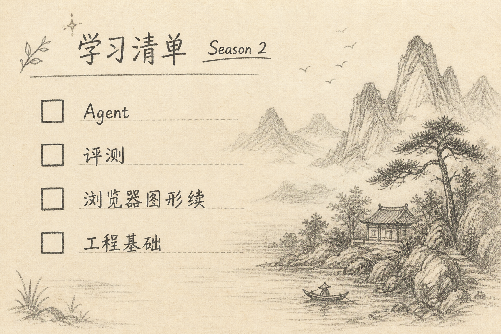
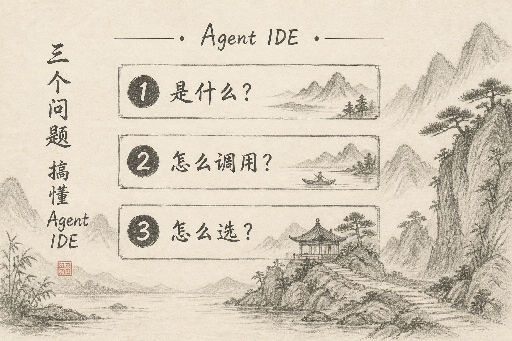

三个月稿件排期走完后，下一季不靠神秘感留人，靠**可核对的清单**。

你若愿意继续看这类文，可以按下面清单追；我若脱节，你也有权用清单催更或弃订。

## 一、清单原则

（1）延续已验证题型：理解 X、专栏、少量热点、少量方法论  
（2）加深 Agent 工程：评测、失败分层、上下文治理  
（3）图形专栏可出「应用篇」，不再只停在原理  
（4）仍零软广优先；若日后挂归档链接，单独说明

## 二、主题清单（公开版）

### A. Agent 工程（主线）

- 评测集从 20 题扩到可自动跑  
- 工具权限与提示注入的最小防护清单  
- 多 Agent / 多工具时的路由与降级  
- 结构化输出接入真实工作流的失败案例

### B. 浏览器里的图形（续）

- Canvas 动画最小循环与脏区  
- OffscreenCanvas / Worker 分工直觉  
- 导出图片与清晰度（接回采样原理）

### C. 基础补强（搜索向）

- Cookie / SameSite 实用向  
- embedding 相似搜索在算什么  
- Docker 多阶段构建入门（机动池升级）

### D. 方法论（每月 ≤2）

- 六站标题怎么改一版就够  
- 周更 2～4 篇如何避免写崩

### E. 热点（每周 ≤1）

- 仍用「是什么 / 怎么调用 / 怎么选」  
- 不写纯情绪站队

## 三、节奏

保持周二 / 周四 / 周六附近各一篇的习惯；精力不足时底线仍是：母稿 + 主要平台先发。

专栏月更不少于 2 篇连载感，避免断更两周以上无说明。

## 四、你怎么用这份清单

（1）收藏本文，按月对照是否在交付  
（2）对某条特别想看，留言题号比空喊「多多更新」有效  
（3）若我连续偏离清单去追纯热点，可以直接拍砖

## 五、小结

下一季公开学什么、写什么，是为了让关注变成「订一份课表」，而不是订一份情绪。清单在，回访才有理由。

（完）
