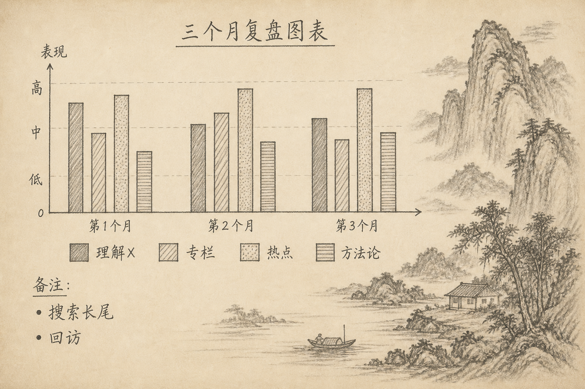
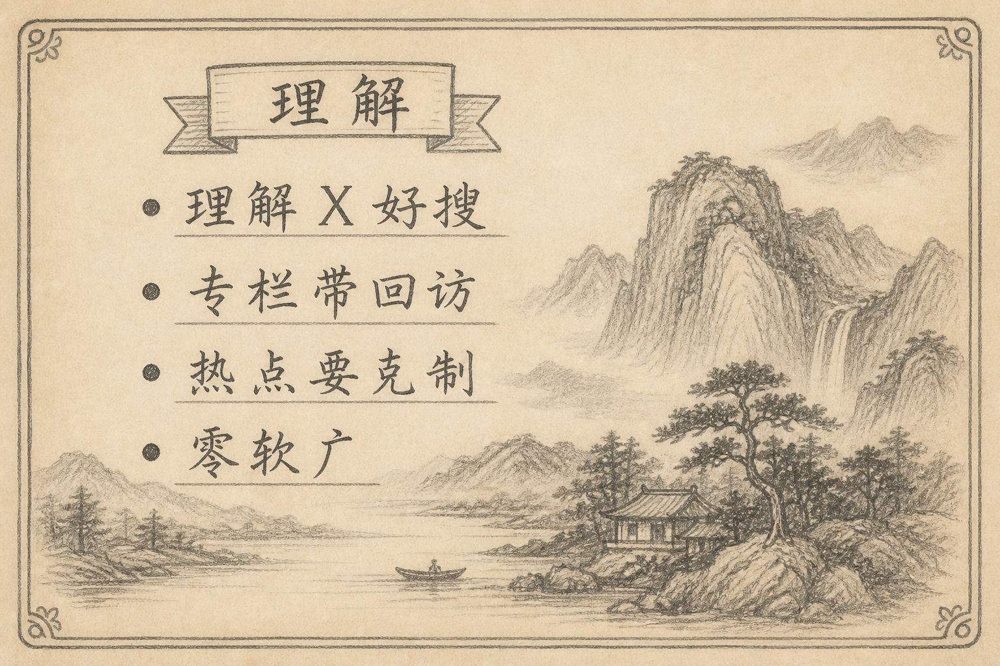

三个月前定的目标很具体：平台流量、关注度、账号权重；纪律是零软广；文风走「理解 / 入门 / 详解」。

现在复盘，不谈感觉，谈机制：阅读、搜索、关注大概分别被哪类稿养活。

## 一、先承认：没有完美数据也要复盘

各平台口径不同，也未必周周记全。仍可按题型做定性结论，并用「老文是否持续有阅读 / 收藏」作搜索代理。

本复盘基于计划执行本身的结构假设与写作中的观察，供下一季校准；你有真实后台数据时，用数改结论。

## 二、四类内容各自干什么

### 2.1 「理解 X」搜索干货

贡献：长尾进入、收藏、权重积累。  
体感：单日不一定爆，但会在身后慢慢干活。  
教训：标题要像搜索句；开头三拍要兑现。

### 2.2 系列专栏

贡献：回访与关注动机。  
「浏览器里的图形」「Agent 工程笔记」让读者知道下周还来。  
教训：系列要在文内预告下一篇，形成闭环。

### 2.3 热点快评

贡献：脉冲阅读、测人设反应速度。  
教训：每周 ≤1；结构固定「是什么 / 怎么调用 / 怎么选」；不站队发泄。

### 2.4 方法论

贡献：完读与信任（标题、开头、数据怎么看）。  
量少，但稳住「这个人会讲清楚」的印象。

## 三、流量与关注的粗线条答案

（1）**流量脉冲** mainly 来自热点与强时效题  
（2）**可累积流量** mainly 来自「理解 X」与可搜索教程  
（3）**关注** more 来自专栏连续性与文风稳定，而不是单篇爆款  
（4）**权重** 靠持续产出与少翻车（含零软广）

若只追阅读冠军，会低估搜索与专栏。

## 四、纪律是否值得

零软广减少短期导流，但换来：

（1）评论区更干净  
（2）平台判定更像「内容号」而非「带货号」  
（3）以后若分阶段挂归档链接，信任成本更低

三个月阶段目标若是账号本身，这笔账划算。

## 五、下一季加码什么

（1）加码搜索好的「理解 X」加强版（见同周另一篇）  
（2）续写一条 Agent 或图形专栏，不要两条同时开太猛  
（3）热点保持配额，避免变成发布会搬运号  
（4）坚持周日四列数据：阅读、搜索代理、关注、题型

## 六、小结

流量来自脉冲与长尾两条河；关注来自可预期的再见面。三个月最该保留的，不是某篇爆款，而是选题配比、开头写法与零软广纪律。

（完）
