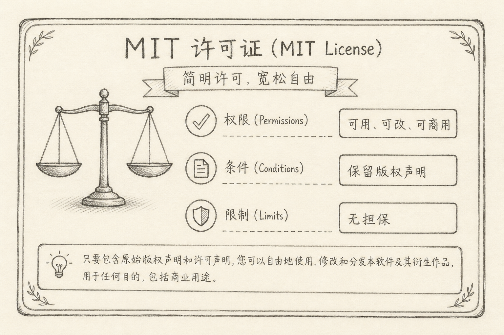
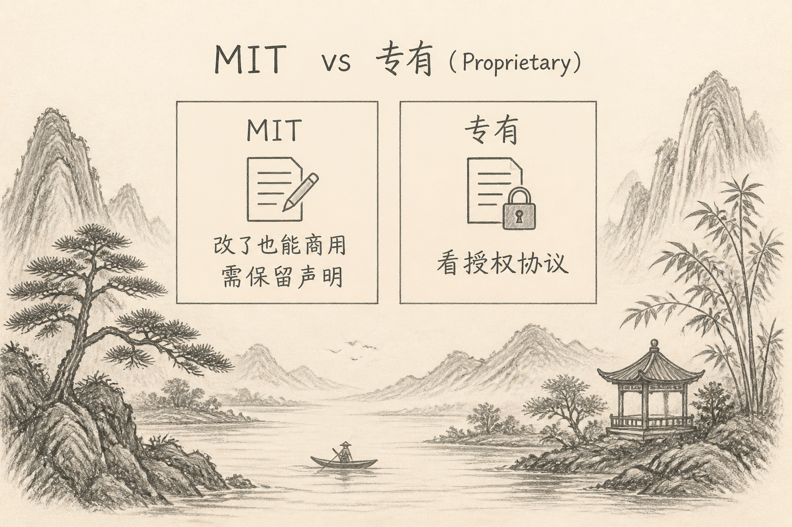

MIT License 是一种宽松的开源许可证。许多前端库、工具与 SDK 采用它。

对使用者，真正要记住的不是法律史，而是三件事：**你可以做什么、你必须保留什么、出了问题谁负责**。

## 一、先说一个具体麻烦

你在项目里用了一个 MIT 许可的库，准备上线商用产品。有人说「开源就不能商用」，有人说「MIT 随便用不用管」。

两种说法都不精确。MIT 通常**允许商用**，但**不是零义务**；也**不提供质量担保**。

## 二、许可给你的大致权限

在常见理解下，MIT 允许你：

（1）使用、复制  
（2）修改  
（3）合并进闭源或商用产品  
（4）再分发  
（5）再许可（在满足条件的前提下，实践中很常见）

相对 GPL 等「传染性」更强的协议，MIT 对「改完是否必须开源你的整站」约束更松。具体以你依赖的许可证全文为准；多依赖并存时要整体评估。

## 三、你通常需要遵守的条件

核心条件很短：在发行副本中**保留版权声明与许可声明**。

实务上：

（1）保留原作者的 `LICENSE` / copyright notice  
（2）若分发二进制或打包产物，按惯例附上声明（各生态工具常自动收集）  
（3）不要删除归因信息后假装自己原创了整份上游代码

做不到「保留声明」，就不是「随便用不用管」。

## 四、「无担保」是什么意思

MIT 文本通常明确：软件按「AS IS」提供，作者不承担因使用导致的损害责任（在法律允许范围内）。

含义是：

（1）能用 MIT 库 ≠ 作者保证无 bug、无漏洞  
（2）线上事故，责任与风险要自己的工程与合规流程扛  
（3）安全审计、测试、升级策略仍是你的事

## 五、对使用者的决策清单

（1）商用产品：MIT 依赖通常友好，但仍要保留声明  
（2）修改源码再分发：可以，带上原许可声明  
（3）多许可证项目：以最严约束与法务意见为准，本文不替代法律咨询  
（4）模型权重 / 数据：不一定是 MIT；别把「代码 MIT」误当成「权重也 MIT」

## 六、常见误区

（1）**开源 = 不能商用**  
MIT 恰恰常用于可商用组件。  
（2）**MIT = 无需署名**  
需要保留许可与版权声明。  
（3）**MIT = 作者背锅**  
无担保条款在提醒相反事实。  
（4）**只看 GitHub 上的 SPDX 标签，不打开 LICENSE**  
标签方便，全文更准。

## 七、小结

对使用者，MIT 的大意是：你可以较自由地用、改、商用与再分发；请保留声明；出问题默认自担。

把它当成「宽松且需保留署名的合同」，比当成「完全没有规则」或「禁止商用」都更接近日常工程现实。

（完）
