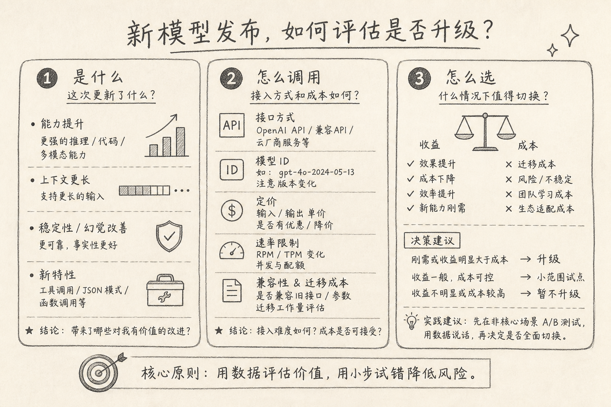
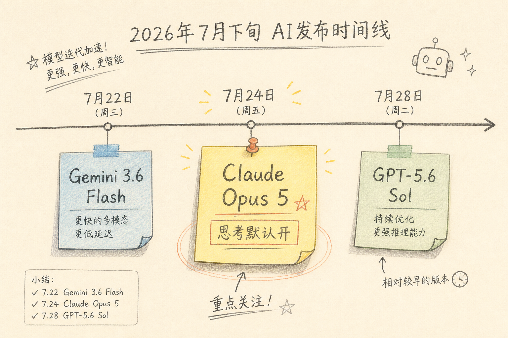

Anthropic 在 2026 年 7 月 24 日发布了 Claude Opus 5。官方把它定位成更适合日常使用的旗舰档：编码与知识工作评测上更强，价格与上一代 Opus 4.8 同档。

热点文容易写成发布会摘要。我对这类更新只关心三件事：**是什么变了、怎么调用、值不值得换**。下面按这个结构写，并顺带对照同阶段另外几条模型动态。



## 一、这一周前后在吵什么

近期不止 Opus 5 一条新闻。大致时间线可以记成：

（1）OpenAI 一侧继续推进 GPT-5.x 家族（含推理向旗舰与 Instant 默认模型更迭），并安排旧模型退场  
（2）Google 放出偏效率向的 Gemini 3.6 Flash  
（3）Anthropic 发布 Opus 5，并强调 effort（思考强度）与默认思考行为



本文主线仍是 Opus 5。其余只作对照，避免一篇稿里五场发布会一起讲。

## 二、是什么：相对 Opus 4.8，你能感知的变化

根据官方公告与开发者文档，我对「日常写代码 / 跑 Agent」相关的变化，压缩成四点。

### 2.1 同价位，宣称更高的编码与知识工作表现

定价仍是约 **$5 / 百万 input tokens**、**$25 / 百万 output tokens**（与 Opus 4.8 相同）。官方用多条内部与合作方评测说明：同样成本下，完成率与质量更高，尤其软件工程与长程任务。

评测数字会随 harness 变化，我不当成绝对真理。对使用者更有用的信号是：**同价换代，而不是同能力涨价**。

### 2.2 思考相关默认值变了

文档写明：在 Opus 5 上，请求默认带思考行为；深度主要由 **effort** 控制。这和「思考模式要不要开」那篇文章直接相关——产品把「要不要想一会」从可选开关，推向更接近默认路径。

含义很实际：

（1）延迟与用量可能和你在 4.8 上的体感不同  
（2）移植旧代码时，要检查自己是否还在按「默认不思考」写假设  
（3）想省钱或降延迟，优先调 effort，而不是以为模型变笨了

具体字段以 Anthropic 当前 API 文档为准；字段名与枚举会迭代，这里不背死参数表。

### 2.3 Fast mode 仍在

官方提供约 2.5 倍默认速度的 Fast mode，价格约为基础价两倍。适合「要 Opus 档质量、但更在意等待」的交互场景；批处理长任务未必划算。

### 2.4 平台侧两个 beta：中途改工具、自动 fallback

（1）对话中途改可用工具，且不轻易毁掉 prompt cache——对 Agent 很实用  
（2）安全分类器拦截时，可自动落到另一模型，而不是整请求直接失败

这两项不改变模型权重，但会改变线上稳定性与缓存成本。做平台集成的人值得单独记一笔。

## 三、怎么调用：最小落地清单

（1）API 模型 id：官方示例为 `claude-opus-5`（AWS / Google Cloud 另有对应名称）  
（2）价格：与 Opus 4.8 同档；Fast mode 另计  
（3）客户端：Claude.ai / Claude Code 等产品线已可选用；第三方编辑器是否默认切换，看各产品自己的模型表  
（4）回归：把你现有的「难任务集」跑一遍——修 bug、多文件改动、长约束生成——对比 4.8 的通过率、轮次、费用

下面是一个仅作示意的请求骨架（字段以你当天文档为准）。

```bash
curl https://api.anthropic.com/v1/messages \
  -H "content-type: application/json" \
  -H "x-api-key: $ANTHROPIC_API_KEY" \
  -H "anthropic-version: 2023-06-01" \
  -d '{
    "model": "claude-opus-5",
    "max_tokens": 1024,
    "messages": [{"role": "user", "content": "用三句话说明 effort 是干什么的"}]
  }'
```

上面代码中，关键是把 `model` 换成新 id，并在真实项目里补上你团队统一的 system 约束与工具定义。不要只靠改模型名期待奇迹。

## 四、怎么选：什么时候换，什么时候先别动

值得优先试用的情况：

（1）你已经在用 Opus 4.8，账单可接受，只是质量/稳定性不够  
（2）主场景是 Agent 编码、长程调试、多步工具调用  
（3）你需要在「更强」与「别涨价」之间找折中，而不是追求绝对最贵旗舰

可以先观望的情况：

（1）任务主要是短问答、格式转换，更小更快的模型已经够用  
（2）流水线强依赖旧模型的延迟曲线，尚未做 effort / Fast mode 压测  
（3）安全策略或行业合规要求固定模型版本，换代需走评审

和同阶段其它模型怎么并列看：

（1）要极致推理旗舰、且绑定某家生态——对照 OpenAI 推理向型号与定价，不要只看营销名  
（2）要低成本高吞吐日常任务——对照 Gemini Flash 一类效率向型号  
（3）要 Claude 生态里的「日常最强 Opus」——Opus 5 是当前更合理的默认候选

我自己的顺序通常是：**先在评测集上 A/B，再改默认模型**。发布日当天全量切换，风险大于收益。

## 五、和「思考模式」文章的衔接

若你刚读过「什么时候该开思考模式」，可以把 Opus 5 理解成：厂商把「多想一会」嵌进默认行为，再用 effort 调节预算。

对使用者，原则不变：

（1）题难在推理，才值得加思考预算  
（2）题难在缺材料，先补上下文  
（3）用验收条件判断换代是否真的更好，而不是看发布会形容词

## 六、小结

Opus 5 对开发者最要紧的，不是又一张榜单，而是三句话：

（1）同价换代，编码与长程任务是主卖点  
（2）思考默认路径与 effort 会影响延迟和账单，迁移时要回归  
（3）先用自己的难任务集验证，再决定是否设为默认

热点会过，评测集会留下。把「是什么 / 怎么调用 / 怎么选」写成习惯，以后每场发布会都能在一小时内消化完。

（完）
