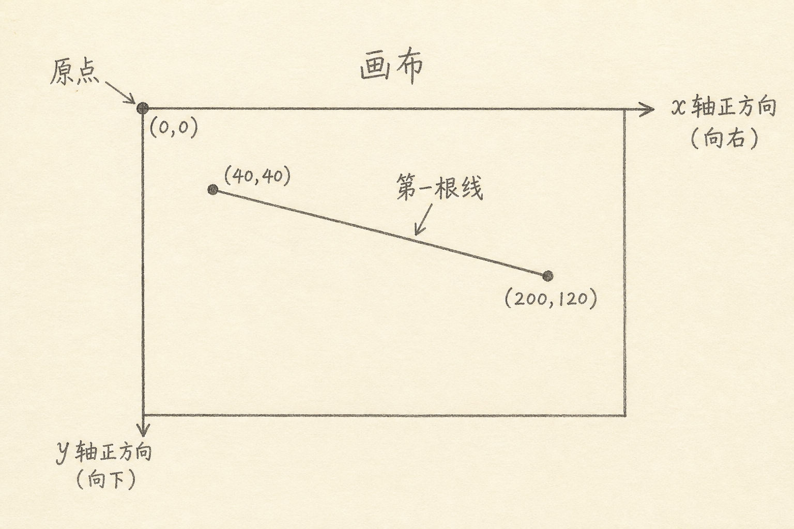
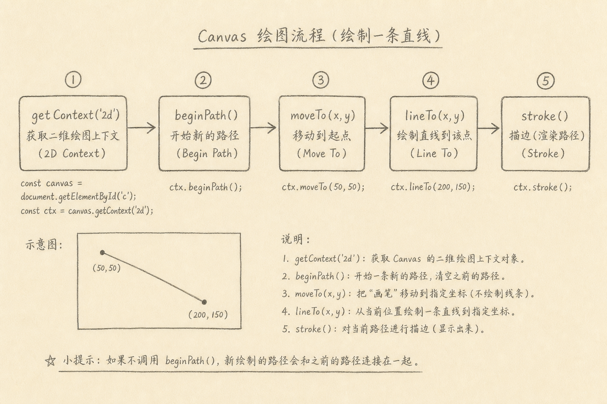

Canvas 是浏览器提供的一块位图画布：你用脚本下指令，像素被画上去，适合图表、小游戏、图像处理入门。

本系列叫「浏览器里的图形」。第一篇只做一件事：从一张空白 `<canvas>` 走到屏幕上的第一根线。不引入框架，不讲性能玄学，先把坐标系和路径节奏跑通。



## 一、为什么从「一根线」开始

很多教程一上来画复杂动画。读者能跟着跑，却说不清：

（1）`(0, 0)` 在哪  
（2）为什么改 CSS 宽高，图画糊了  
（3）`beginPath` / `stroke` 各自干什么

一根线足够暴露这些问题。线画对了，矩形、折线、清屏都只是同一套 API 的扩展。

## 二、准备一块画布

下面是一个最小 HTML。

```html
<canvas id="c" width="400" height="240"></canvas>
```

上面代码中，`width` / `height` 属性是**绘图缓冲区**的像素尺寸，不是 CSS 外观尺寸。若再用 CSS 把元素拉大却不改属性，位图会被拉伸，线条容易发糊。入门阶段：属性尺寸与显示尺寸保持一致最省事。

取上下文：

```js
const canvas = document.getElementById('c')
const ctx = canvas.getContext('2d')
```

上面代码中，`'2d'` 拿到 2D 绘图上下文。没有上下文，后面所有绘制都无从谈起。WebGL 是另一条路，本系列后面再碰。

## 三、坐标系：原点在左上

Canvas 2D 默认：

（1）原点 `(0, 0)` 在左上角  
（2）`x` 向右增大  
（3）`y` **向下**增大

这和部分数学课上的「y 向上」习惯相反。第一次画线偏到奇怪位置，多半是 y 方向搞反了。

## 四、画第一根线的固定节奏

2D 路径绘制，常见节奏是：

（A）`beginPath()` 开始新路径  
（B）`moveTo(x, y)` 落笔起点  
（C）`lineTo(x, y)` 连到下一点  
（D）设置 `strokeStyle` / `lineWidth`（可在 stroke 前）  
（E）`stroke()` 真正描边



完整示例如下。

```js
const canvas = document.getElementById('c')
const ctx = canvas.getContext('2d')

ctx.beginPath()
ctx.moveTo(40, 40)
ctx.lineTo(360, 200)
ctx.strokeStyle = '#333'
ctx.lineWidth = 2
ctx.stroke()
```

上面代码中，前三步只是在「描述路径」，最后 `stroke()` 才把线画进像素。忘了 `stroke`，屏幕仍是空白，这是入门最高频的坑之一。

只画填充形状时用 `fill()`；线用 `stroke()`。两者可以组合，但第一根线只需要 `stroke`。

## 五、清屏与重画

动画或交互前，通常要擦掉上一帧：

```js
ctx.clearRect(0, 0, canvas.width, canvas.height)
```

上面代码中，从 `(0,0)` 清到画布宽高。不清理就重画，轨迹会叠在一起——有时是效果，有时是 bug。

## 六、和 DOM 绘图的差别（先有直觉）

（1）Canvas 画完是像素，不保留「一根线」的 DOM 节点  
（2）要点选某根线，需要自己做几何命中，或换 SVG  
（3）适合大量图元、逐帧重绘；不适合靠 CSS 轻松做文档型布局

第一篇不必选技术宗教。记住：Canvas 是**命令式位图 API**。

## 七、常见误区

（1）**只改 CSS 宽高，不改 canvas 属性**  
导致拉伸模糊。

（2）**忘记 `beginPath`，连续 stroke 粘连**  
旧路径可能被一起描出。

（3）**以为 `lineTo` 立刻可见**  
没有 `stroke`/`fill` 不会上屏。

（4）**高 DPI 屏不考虑 `devicePixelRatio`**  
进阶再处理；现在先保证属性尺寸正确。

（5）**把 Canvas 当万能 UI**  
按钮、表单仍优先用 HTML。

## 八、小结与下一篇预告

今天走通的最小路径是：取 `2d` 上下文 → 弄清左上原点 → `beginPath` / `moveTo` / `lineTo` / `stroke`。

下一篇预告：`ImageData`——从像素数组读写颜色，为图像处理打底。

（完）
