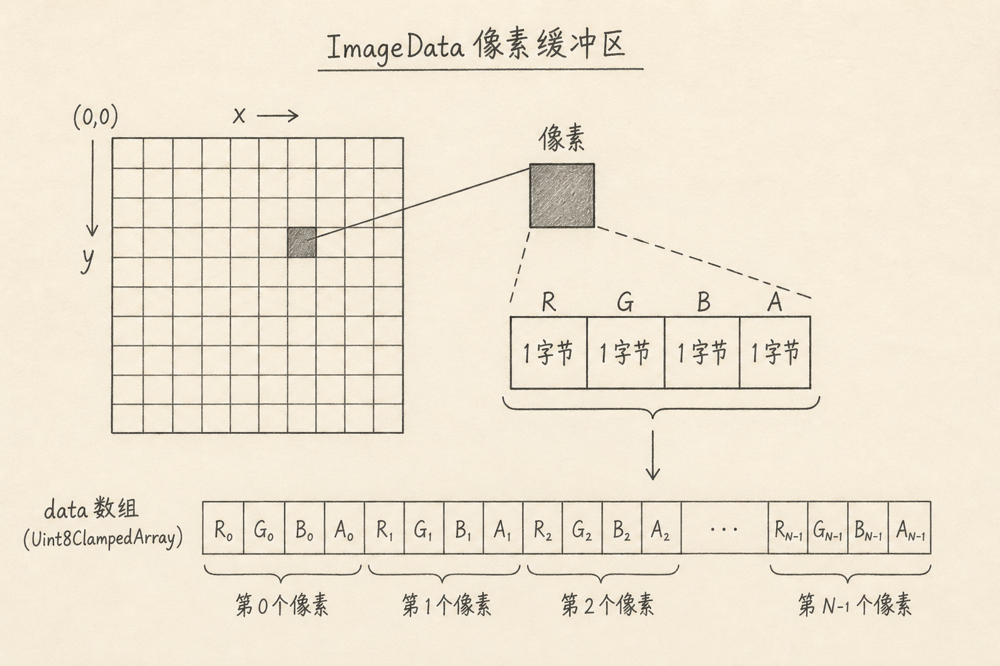
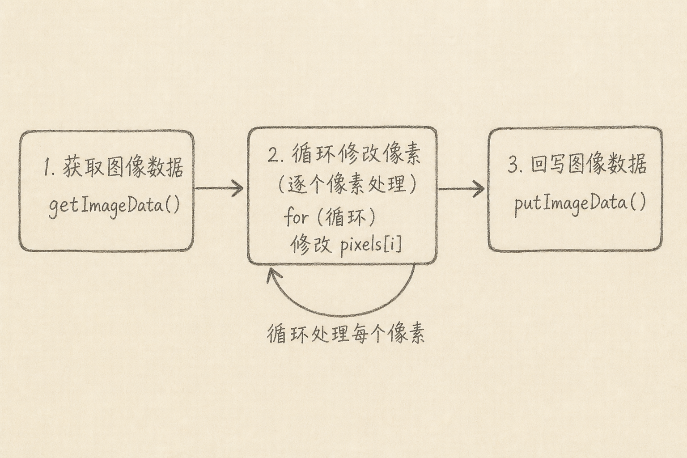

ImageData 是 Canvas 里表示一块矩形像素的数据对象：宽度、高度，以及一段按 RGBA 排好的字节数组。

上一篇画了第一根线。线是「路径指令」；滤镜、取色、简单识别，往往要碰到「每个像素」。本篇只建立最小路径：把像素读出来、改一改、写回去。



## 一、为什么需要碰像素

路径 API 擅长描边与填充。下面这些事它不直接给：

（1）把彩色图变成灰度  
（2）读某个坐标的颜色做取色器  
（3）按阈值做很简单的阈值分割

这时要进入位图数据层。ImageData 就是浏览器给你的那一层「可读写的像素缓冲」。

## 二、data 数组怎么排

`imageData.data` 是一个一维数组（`Uint8ClampedArray`），每 4 个数字描述一个像素：

```text
[R, G, B, A,  R, G, B, A,  ...]
```

（1）`R/G/B/A` 取值 0～255  
（2）`A` 是透明度，255 通常表示不透明  
（3）第 `i` 个像素（从 0 起）的红色下标是 `i * 4`

已知坐标 `(x, y)`、图像宽度 `w`，下标可以写成：

```js
const i = (y * w + x) * 4
const r = data[i]
const g = data[i + 1]
const b = data[i + 2]
const a = data[i + 3]
```

上面代码中，先按行主序找到像素，再取四个通道。搞错 `* 4` 或宽高，颜色会花屏。

## 三、读写的固定三步

常见流水线：

（A）`getImageData(x, y, w, h)` 读出一块  
（B）改 `data`  
（C）`putImageData(imageData, x, y)` 写回



下面做一个最小灰度示例（假定画布上已有内容）。

```js
const canvas = document.getElementById('c')
const ctx = canvas.getContext('2d')
const img = ctx.getImageData(0, 0, canvas.width, canvas.height)
const data = img.data

for (let i = 0; i < data.length; i += 4) {
  const y = 0.299 * data[i] + 0.587 * data[i + 1] + 0.114 * data[i + 2]
  data[i] = data[i + 1] = data[i + 2] = y
}

ctx.putImageData(img, 0, 0)
```

上面代码中，循环步长为 4；亮度用常见加权近似。`A` 通道未改，透明区域保持原样。这不是唯一灰度公式，但够用来理解「改的是数组，不是路径」。

## 四、和 drawImage 的关系

处理照片前，通常先把图画上画布：

```js
ctx.drawImage(image, 0, 0, canvas.width, canvas.height)
```

上面代码中，`image` 可以是 `HTMLImageElement` 等。注意跨域图片若未正确 CORS，`getImageData` 会污染画布并抛错。本地实验可用同源图，或确保服务器返回允许的 CORS 头。

## 五、性能直觉（先知道边界）

（1）整画布逐像素 JS 循环，大图会卡；入门可以，产品要考虑 Worker / Wasm（本系列后续再谈）  
（2）频繁 `get/put` 整屏，不如缩小处理区域  
（3）`Uint8ClampedArray` 会自动把越界值夹到 0～255，赋值时要注意「以为能溢出却被夹住」

## 六、常见误区

（1）**把 data 当成二维数组**  
它是一维的，要自己算下标。

（2）**忘记 `putImageData`**  
改数组不会自动反映到屏幕。

（3）**循环写成 `i++` 而不是 `i += 4`**  
通道错位，颜色花掉。

（4）**在被污染的画布上读像素**  
跨域图未授权时会失败。

（5）**用 ImageData 做 UI 布局**  
按钮与文字仍优先 DOM；像素层留给图像算法。

## 七、小结与下一篇预告

ImageData 让你按 RGBA 读写画布上的一块位图。最小路径是：`getImageData` → 按 `i += 4` 改通道 → `putImageData`。

下一篇预告：位图为什么放大会糊——采样与矢量，只讲原理，继续留在「浏览器里的图形」专栏。

（完）
