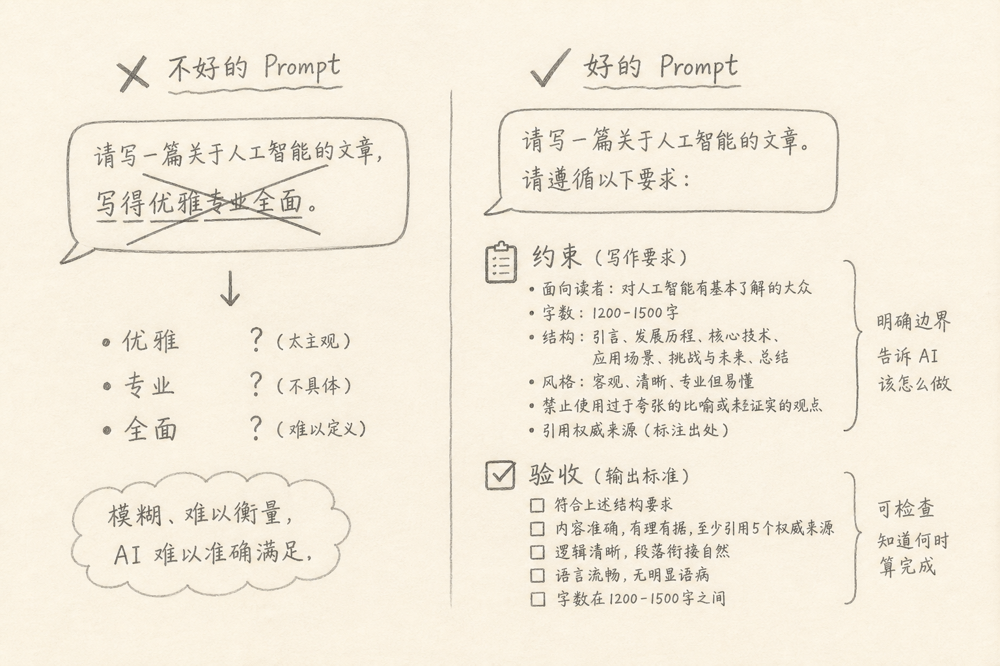
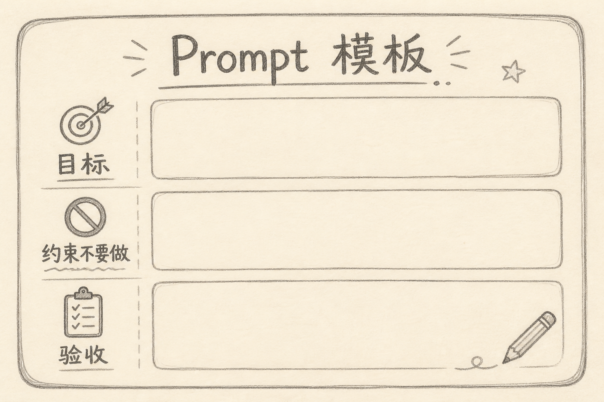

Prompt（提示词）是你给模型的任务说明。写得含糊，输出就漂；写得可检查，输出才容易收敛。

很多人习惯堆形容词：「写得优雅、专业、全面、生产级」。这些词对人有感觉，对模型几乎没有可执行标准。更有效的写法是：**约束（不要做什么）+ 验收（怎样算完成）**。



## 一、先说一个具体麻烦

你对 Agent 说：

```text
优化一下用户列表页，做漂亮点，注意性能和可维护性。
```

可能发生：

（1）改了你没让动的路由  
（2）引入新依赖  
（3）「漂亮」变成另一套设计语言  
（4）你说不清它有没有做完

问题不在模型「不听话」，而在任务没有可判定边界。形容词制造的是气氛，不是判据。

## 二、为什么形容词弱

（1）**不可判定**：什么叫优雅？十个人十种答案  
（2）**不可比较**：两次输出都「专业」，你无法说谁更对  
（3）**易引发过度改动**：模型用更多改动证明「全面」  
（4）**难自动化**：CI 没法断言「够不够优雅」

模型擅长在明确空间里搜索；你把空间留成雾，它就只能猜。

## 三、约束是什么，验收是什么

### 3.1 约束（Constraints）

规定边界与禁止项，缩小动作空间。

举例：

（1）只改 `apps/web/components/UserList.tsx`  
（2）不新增依赖  
（3）不改 API 契约  
（4）不要重写样式体系

### 3.2 验收（Acceptance）

规定可观察的完成条件。

举例：

（1）`pnpm --filter web typecheck` 通过  
（2）空列表显示「暂无用户」  
（3）错误态有重试按钮  
（4）列表超过 100 条仍可滚动且不锁死主线程（若你真要性能，写清场景）

约束管「别跑偏」，验收管「何时停」。两者一起，才构成一张小工单。



## 四、一个可复用模板

```text
目标：……（一句话）
范围：只动哪些文件 / 模块
约束：
- 不要……
- 不要……
验收：
- [ ] ……
- [ ] ……
```

把前面的坏例子改写：

```text
目标：用户列表在无数据时给出明确空态，并修复 TypeScript 报错。
范围：只改 UserList.tsx 与对应测试。
约束：
- 不新增 UI 库
- 不改 /api/users 响应形状
验收：
- typecheck 通过
- 空数组时渲染「暂无用户」
- 现有分页交互保持不变
```

上面两段对比里，第二段可以被人（和 Agent）逐条勾选。做完就是做完，没有「再漂亮一点」的无限游戏。

## 五、和思考模式、Agent 工具的关系

（1）约束写清后，普通模式也常够用；先别把希望寄托在「多想一会」  
（2）Agent 越能改仓库、接 MCP 工具，越需要约束，否则能力变成事故半径  
（3）验收最好能跑：命令、测试、截图对比，而不是「我觉得还行」

形容词可以留一点点作风格参考（「语气简洁」），但只能当调味，不能当主菜。

## 六、常见误区

（1）**约束写成空话**：「注意安全」不如「不要打印密钥、不要提交 .env」  
（2）**验收不可观察**：「代码质量高」无法勾选  
（3）**范围过大**：一次工单跨五个子系统，约束也会失效  
（4）**只有验收没有约束**：模型可能用歪门邪道凑验收（删测试冒充通过）  
（5）**堆砌二十条约束**：抓主要矛盾；次要项留到下一轮

## 七、小结

Prompt 里，形容词负责感觉；约束与验收负责结果。

把任务写成「目标 + 范围 + 不要做什么 + 如何验收」，模型更稳，你也更好 review。会写工单，比会堆修饰词更接近工程。

（完）
