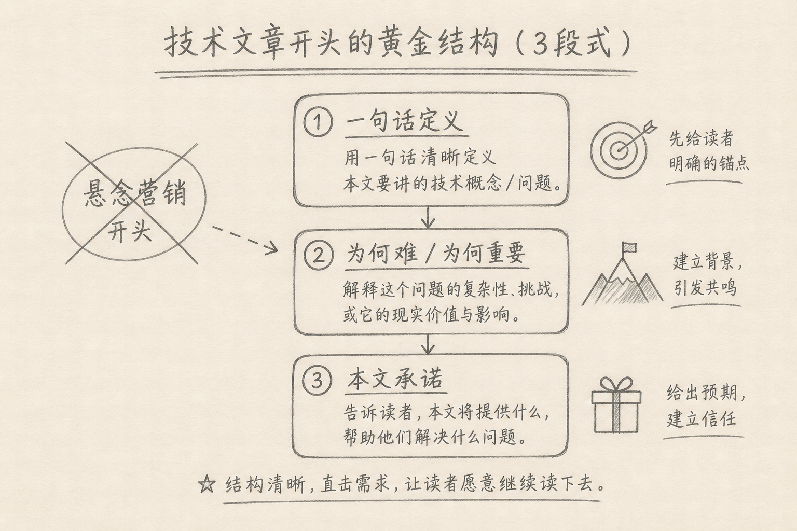
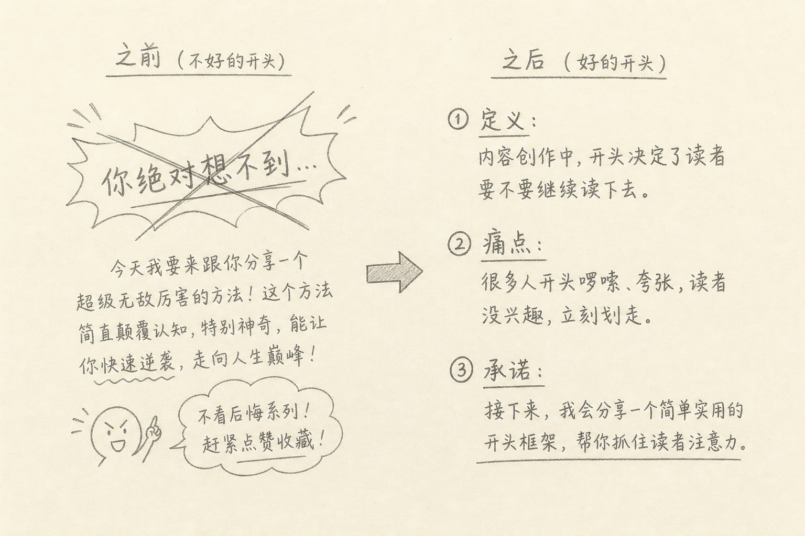

技术文的开头大约 300 字，往往决定读者是往下翻，还是划走。

标题把人引进来；开头负责两件事：**确认「没点错」**，以及**相信「往下有干货」**。很多稿子死在这里：要么悬念营销，要么术语堆砌，要么作者自说自话。

下面给一套可复用的三拍写法，专门对准搜索与完读，不对准喊口号。



## 一、先看坏开头长什么样

常见几类：

（1）**悬念腔**：「你绝对想不到，CORS 背后隐藏着……」  
（2）**履历腔**：「从业十年，我终于想明白……」  
（3）**百科腔**：第一段就甩规范编号与冷门术语，没有场景  
（4）**目录腔**：开头变成小标题列表，读者仍不知道文章立场

它们共同问题是：读者无法在 20 秒内回答「这是什么、关我什么事、文中会讲清什么」。



## 二、三拍结构（合计大约 300 字）

固定顺序，可略删，不建议打乱：

### 2.1 第一拍：一句话定义

对象是什么、用来干什么。短句，尽量不含比喻。

举例：

> JWT 是一种把声明编码成可传递字符串的方式，常见形态是三段用点号连接的文本。

读者立刻知道主题边界。

### 2.2 第二拍：为何现在痛 / 为何容易懵

写具体麻烦，或写「资料术语多、读完仍不清楚哪一点」。不要夸大焦虑。

举例：

> 登录后请求头里那串 `xxxxx.yyyyy.zzzzz`，有人当加密，有人当会话银弹。两段理解都容易在排障时走偏。

### 2.3 第三拍：本文承诺

用直白句子说明本文将讲清什么；必要时加「下面是我的整理」。不写「看完你就是专家」。

举例：

> 下面按三段结构说明 Header、Payload、Signature 各自做什么，以及 JWT 不能解决什么。

三拍写完，大约 200～350 字。够用了。后面接首图或第一节，不要在开篇再塞半篇背景史。

## 三、一段完整示例（可当模板改）

```text
AbortController 用来取消异步操作：创建后把 signal 交给 fetch，再在需要时 abort。

默认的 fetch 不会因「等太久」自己失败。页面转圈、用户连点、组件卸载后回调仍回来，都和缺取消有关。

下面说明超时如何用定时 abort 实现、哪些错误才值得重试，以及怎样和 UI 状态对齐。
```

上面三段里：第一段定义，第二段痛点，第三段承诺。没有感叹号，没有「必看」。读者若需求不匹配，会离开——这是好事，比留下一群失望的人强。

## 四、写开头时的具体约束

（1）**一段一事**，每段 1～3 句  
（2）**先场景或定义，后术语展开**；开篇少塞缩写表  
（3）**承诺要可检验**：「说明三段分别是什么」比「全面精通安全」可检验  
（4）**不预告十章**：开篇只承诺本篇主线；系列文可一句带过「第几篇」  
（5）**中英文之间加空格**，标点用全角为主，保持可读

## 五、和标题、第一节怎么衔接

（1）标题已含对象与角度时，开头不要换题  
（2）开篇后的第一节，接「具体麻烦」展开，而不是重复定义三遍  
（3）若有配图，放在三拍之后、第一节前后均可；图下不要再写「上图是……」

标题负责搜索意图，开头负责兑现标题，第一节负责进入机制。三角色别抢戏。

## 六、自检：发出前 30 秒

（1）外行能否从第一段说出主题词？  
（2）第二段是否出现可想象的麻烦（而不是空叹「很重要」）？  
（3）第三段承诺是否能在文末打勾验收？  
（4）是否还有震惊体、专家口吻压人？  
（5）删掉开头后，正文是否仍突然从细节炸弹起跳？（若是，开头缺过渡）

## 七、常见误区

（1）**把开头写成摘要全集**  
细节留给正文，开篇只定方向。

（2）**第一句就「众所周知」**  
既不亲切，也可能不成立。

（3）**承诺过大**  
「从零到精通」若正文只是入门，完读与信任双杀。

（4）**用故事开头却不回到技术对象**  
可以有场景，但场景必须指向定义与承诺。

（5）**开头堆链接与导流**  
本阶段更伤完读；技术信任靠讲清楚建立。

## 八、小结

留得住的技术文开头，通常不是更会煽情，而是更会对齐：

定义对象 → 点出麻烦或难点 → 说出本文交付什么。

把这三拍控制在约 300 字，读者能快速决定去留；留下的人，才有机会读到你真正想写的那部分。

（完）
