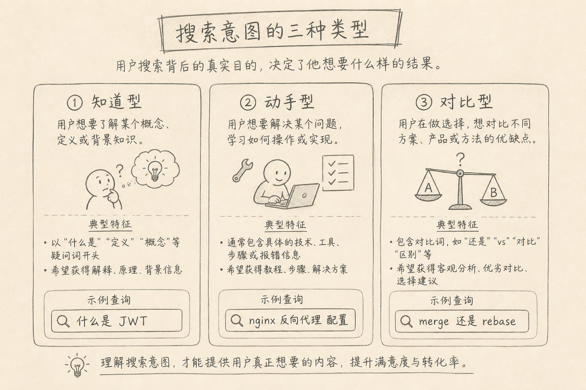
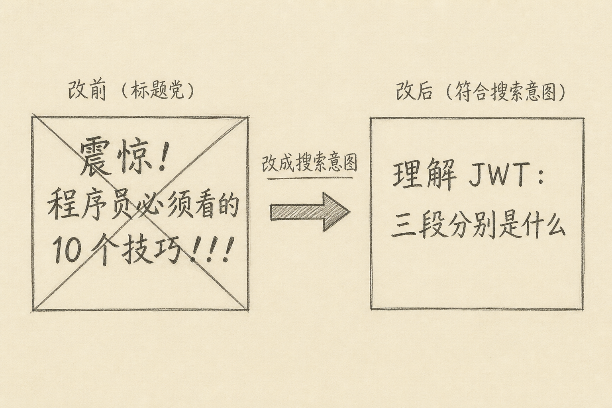
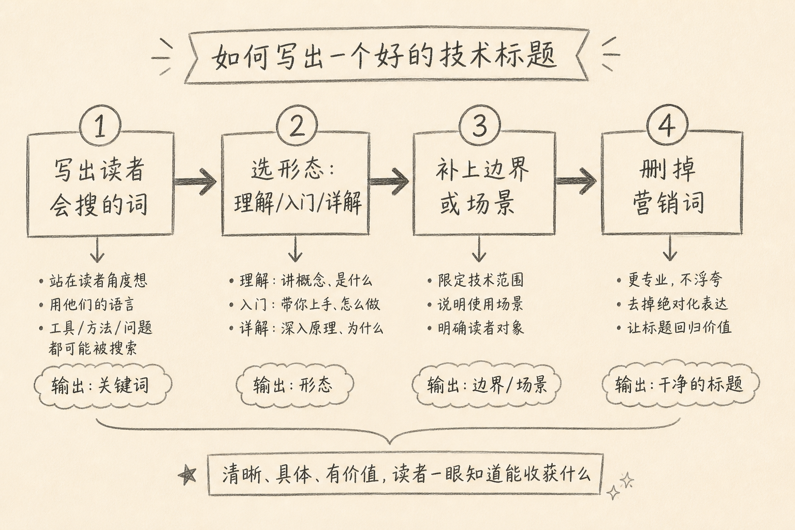

标题是读者决定点不点开的第一句话，也是搜索引擎判断「这篇文章在答什么问题」的短信号。

技术文作者常在两个极端之间晃：要么标题党（震惊、必看、终极），要么自嗨（一个关于 XXX 的想法）。前者伤信任，后者没人搜得到。

下面按「搜索意图」来起标题：先想人会怎么搜，再决定标题长什么样。



## 一、先分清读者在搜什么

同样写 JWT，意图不同，标题就不同。

（1）**知道型**：想搞懂概念。常见搜法：「什么是 JWT」「JWT 原理」「理解 JWT」  
（2）**动手型**：想照着做。常见搜法：「nginx 反向代理 配置」「Cursor Agent 怎么用」  
（3）**对比型**：想做选择。常见搜法：「merge 还是 rebase」「401 和 403 区别」

还有一类**排障型**：「cors 跨域报错」「context length exceeded 怎么办」。它接近动手型，但情绪更急，标题里出现报错关键词往往更有效。

写标题前，先用一句话回答：这篇文章主要满足哪一种意图？意图不纯时，选一个主意图，次要意图放到副标题或文内小标题，不要塞进主标题里打架。

## 二、标题形态：优先用「直白动词 / 名词」

中文技术博客里，长期好用、也不显摆的形态大致是：

（1）`理解 X`：概念文  
（2）`X 入门`：从零到能用  
（3）`X 详解`：比入门更深、结构更全  
（4）`X 教程`：强步骤、可照做  
（5）`X 与 Y：怎么选 / 区别`：对比文

这些形态的好处是：和真实搜索句贴近，读者三秒内知道自己会不会看错文。

相对地，尽量少用：

（1）「深度揭秘」「全网最全」「看完你会…」  
（2）纯情绪词堆叠与过多感叹号  
（3）只有比喻、没有对象：「给你一把打开网络的钥匙」（读者无法判断主题）



## 三、一条可复用的起标题流程

我实际写稿时，固定走四步。

### 3.1 写出读者会搜的词

不要先想「帅不帅」，先列 5 个可能的搜索词。可以用自己的原话，也可以看相关文档的目录用词。

例如主题是上下文窗口：

- 上下文窗口  
- context window  
- token 限制  
- 上下文不够  
- context length exceeded

### 3.2 选一个形态

概念为主 → `理解上下文窗口`  
若还想带出「限制什么」→ 加冒号补边界。

### 3.3 补上边界或场景（可选，但很有用）

主标题负责对象，冒号后负责角度：

（1）`理解上下文窗口：token 到底在限制什么`  
（2）`HTTP 状态码：只记你真正用得到的那些`  
（3）`Cursor 入门：Tab、行内编辑与 Agent 怎么选`

冒号后不要写空话（「全面解析」），要写**可检验的承诺**。

### 3.4 删掉营销词

删「必看 / 终极 / 从入门到精通（若你其实只写入门）」这类名不副实的词。标题可以短，但不能假。



## 四、多平台怎么改，而不要另起炉灶

同一篇母稿发多站时，我不改论点，只微调标题重心。

（1）**偏搜索的长尾站**（如教程向社区）：保留「理解 / 入门 / 详解」+ 核心词  
（2）**偏信息流的站**：可把场景提前，例如「Tab、行内编辑和 Agent，什么时候用哪个」  
（3）**对比文**：把「区别 / 怎么选」放到更靠前的位置

注意：不要为了每个平台发明完全不同的主题。主题漂移会导致你自己也无法用数据判断「哪类题好用」。

下面是同一选题的三版标题示例。

```text
母稿：理解 MoE：总参数很大，为何还能跑
搜索向：理解 MoE：总参数与激活参数差在哪
信息流向：模型参数上千亿还能跑？先分清总参数和激活参数
对比向：稠密模型与 MoE：哪个数字决定「能不能跑」
```

上面三行里，对象都是 MoE / 参数量；变的是切口，不是换成另一个话题。

## 五、自检清单（发之前 30 秒）

（1）标题里的核心对象，是否就是文中的那个对象？  
（2）一个不懂你的人，能否从标题猜到文章类型（概念 / 教程 / 对比）？  
（3）是否出现无法兑现的词（最全、终极、必看）？  
（4）冒号后是否具体？能否改成验收条件？  
（5）若把标题粘进搜索框，是否像一句真人会搜的话？

若第 5 条不像，多半还是作者视角，不是读者视角。

## 六、常见误区

（1）**先写完正文再随便起个标题**  
更好的做法是：选题时就定意图与标题草案，正文按标题承诺写，写完再微修标题。

（2）**堆叠关键词到读不动**  
`JWT Token 鉴权 登录 原理 详解 教程 实战` 既不像人话，也难建立信任。

（3）**标题过大，正文过瘦**  
叫「详解」却只有五分钟速览，读者会走，也不利于回访。

（4）**用内部项目名当标题主体**  
除非品牌本身就是搜索词，否则读者搜不到，也不关心。

（5）**对比文两边不对等**  
「A 为什么吊打 B」像站队，不像帮助决策。用「怎么选 / 差在哪」更稳。

## 七、小结

技术文标题，优先服务搜索意图：读者想知道、想动手，还是想选择。

流程可以记成：列出搜索词 → 选形态 → 用冒号写清边界 → 删掉营销腔。

标题不是广告语，是对一篇文章的诚实标签。标签准，对的人更容易进来；进来后若内容也兑现，标题才算真正起作用。

（完）
