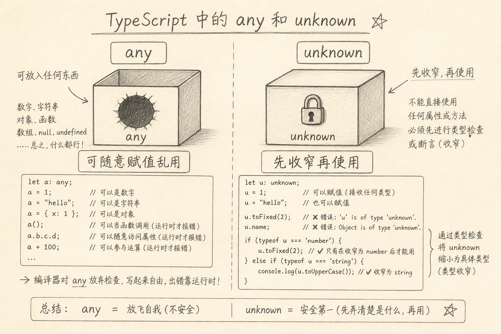
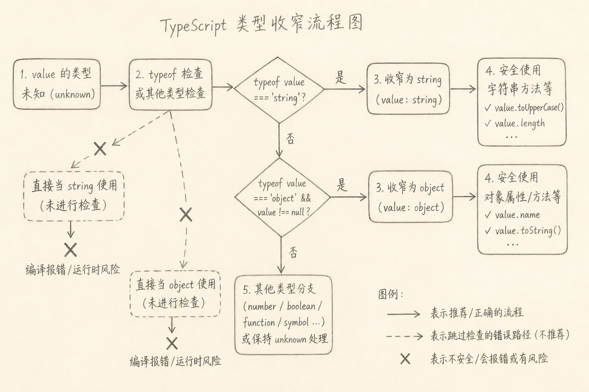

`any` 与 `unknown` 都表示「现在还不知道具体类型」，但对类型检查器的态度完全不同。

`any` 基本意味着：别管我，让我通过。  
`unknown` 意味着：先承认未知，想用就先收窄。

混用的代价是：以为自己在写 TypeScript，实际在关键路径上退回了 JavaScript。



## 一、先说一个具体麻烦

解析接口 JSON：

```ts
const data: any = JSON.parse(text)
console.log(data.user.name)
```

上面代码中，就算 `user` 不存在，编译器也不拦。运行时才炸。

若写成：

```ts
const data: unknown = JSON.parse(text)
console.log(data.user.name) // 报错
```

类型检查会挡住你，直到你证明 `data` 的形状。这就是差别的日常版。

## 二、核心差异一句话

（1）**`any`：类型系统的逃生舱**，可赋给任何东西，也可从任何东西读任意属性/当函数调用（检查基本放弃）  
（2）**`unknown`：安全的未知**，可以接任何值，但**使用前必须收窄**

把值放进变量时，两者都能接「随便什么」。把值拿出来用时，`unknown` 严，`any` 松。

## 三、收窄（narrowing）长什么样

对 `unknown`，常用 `typeof`、`Array.isArray`、in 检查，或校验库。

```ts
function getName(input: unknown): string {
  if (typeof input === 'object' && input !== null && 'name' in input) {
    const name = (input as { name: unknown }).name
    if (typeof name === 'string') return name
  }
  throw new Error('invalid input')
}
```

上面代码中，每一步都在缩小可能类型；最后才当 `string` 用。也可在边界用 zod 等 schema，一次解析出类型。



`any` 不逼你走这条路，所以快，也容易把错误推迟到线上。

## 四、赋值关系上的直觉

（1）任何值都可以赋给 `unknown` / `any`  
（2）`unknown` **不能**随意赋给其它具体类型（除非收窄或断言）  
（3）`any` 可以流到别处，并污染后续推断——一个 `any` 往往带坏一片

因此团队规范常见写法是：

（1）外部输入（JSON、localStorage、第三方 SDK）→ 优先 `unknown`  
（2）逐步消灭 `any`；必要时局部断言，但要注释原因  
（3）写库的公共 API 避免返回 `any`

## 五、什么时候还会看到 any

并非道德洁癖到零 `any` 才算赢。现实里仍可能短暂出现：

（1）与老旧 JS 模块交互的过渡期  
（2）表达「类型系统暂时建模不了」的极窄缝隙  
（3）测试里某些 mock（仍更推荐具体类型）

关键是：**不要把 any 当默认**，尤其不要在业务核心路径上扩散。

## 六、最小对照表

| | `any` | `unknown` |
|--|--|--|
| 接收任意值 | 能 | 能 |
| 直接读属性 | 能 | 不能 |
| 直接当函数调用 | 能 | 不能 |
| 赋给其它类型 | 很容易 | 需收窄/断言 |
| 适合外部输入 | 差 | 好 |

## 七、常见误区

（1）**`unknown` 和 `any` 差不多，随便选**  
用的时候差很多。

（2）**全程 `as any` 消红线**  
等于关掉检查。

（3）**收窄后仍到处断言**  
断言是声明「我保证」，不是验证；能校验就校验。

（4）**只有内部变量用 unknown，边界仍 any**  
边界恰恰最该 unknown。

（5）**误以为 unknown 有运行时代价**  
类型在编译期抹掉；代价是你要多写检查代码——这通常是值得的。

## 八、小结

`any` 让类型检查员下班；`unknown` 让你在使用前出示证件。

处理未知数据时，先收进 `unknown`，再收窄，比一上来 `any` 更符合 TypeScript 的本意。差就差在：**未知之后，你还愿不愿意被检查约束**。

（完）
