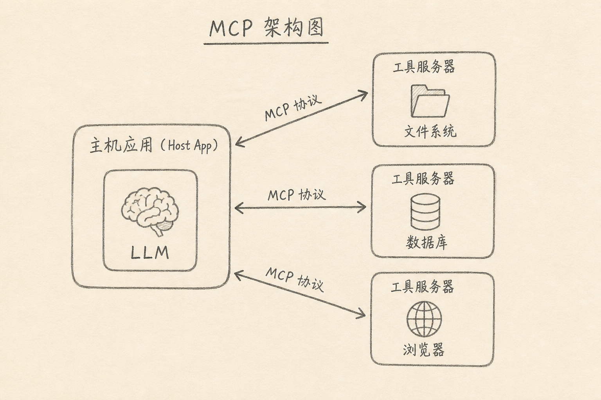
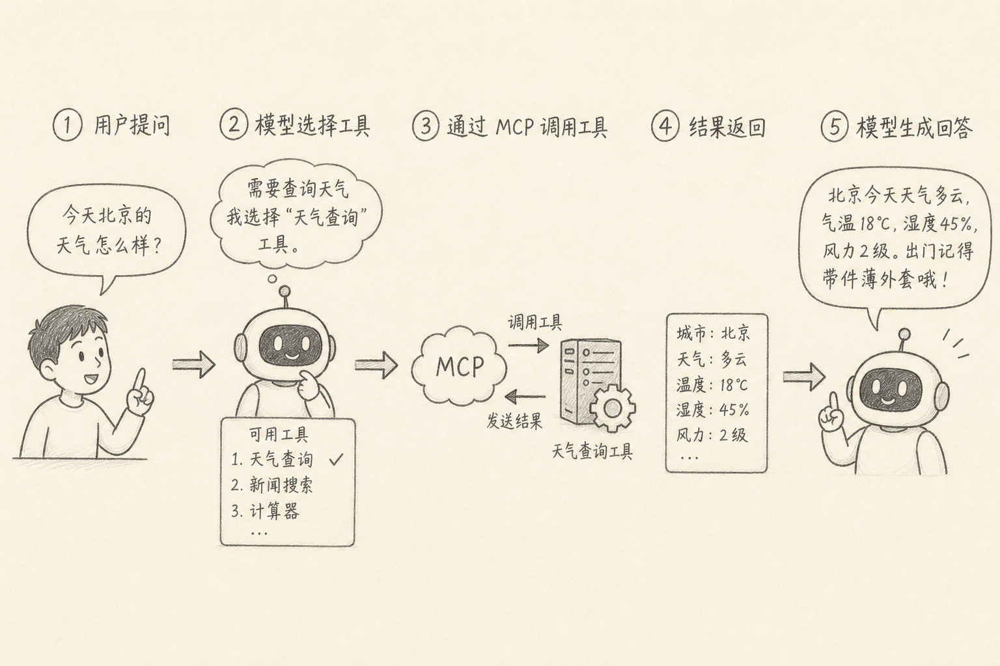

MCP（Model Context Protocol，模型上下文协议）是一种让 AI 应用（宿主）用统一方式连接外部工具与数据源的开放协议。

模型本身不会「真的」读你的磁盘或查库。要办事，得通过工具调用。过去每家产品各写一套插件接口；MCP 想约定一套更通用的接法，让同样的工具服务器能接到不同宿主上。

下面说明它在解决什么问题、基本角色分工，以及一次调用怎么走完。

## 一、先说一个具体麻烦

你做了一个能改代码的 Agent，又想让它：

（1）查公司文档库  
（2）读日历  
（3）跑内部 HTTP 工具

若每个能力都为 Cursor、为自家 Chat 各写一套适配，成本会随「宿主 × 工具」相乘。工具方也烦：每多一个编辑器，就多维护一份集成。

MCP 要缓解的，正是这种**对接爆炸**：工具做成 MCP Server，宿主做 MCP Client/Host，双方按协议说话。

## 二、核心角色

常见三分法（名称以生态文档为准，心智模型稳定）：

（1）**Host（宿主）**：用户面对的应用，如桌面 Agent、IDE 插件；负责编排、鉴权展示、把工具结果塞回模型上下文  
（2）**Client**：宿主里与某个 Server 会话的协议端  
（3）**Server（工具服务器）**：暴露资源、工具、提示模板等能力，例如文件系统、浏览器自动化、数据库只读查询

模型仍在宿主侧被调用。MCP 不训练模型，它规定「工具长什么样、怎么列、怎么调、结果怎么回」。

## 三、一次工具循环怎么转

典型路径：

（A）用户提出目标  
（B）宿主把可用工具描述（名称、参数 schema）提供给模型  
（C）模型决定调用某个工具并给出参数  
（D）宿主经 MCP 向 Server 执行该工具  
（E）结果返回宿主，进入上下文  
（F）模型继续推理：再调工具，或给出最终回答

不难看出：MCP 管的是 **B–E 的标准管道**；模型是否会选对工具，仍取决于提示、权限与产品策略。

## 四、它提供什么能力类别（直觉）

不同 Server 能力不同，常见几类：

（1）**Tools**：可执行动作（写文件、发请求、创建 issue）  
（2）**Resources**：可读的上下文材料（文档、schema）  
（3）**Prompts**：可复用的提示模板

对使用者，最有感的是 Tools：Agent「突然会用」某外部系统，通常就是宿主挂上了对应 Server。

## 五、和「私有插件 / Function Calling」的关系

（1）**Function Calling / Tool Calling**：模型侧的「我要调函数」机制，很多产品都有  
（2）**MCP**：更偏「工具如何被宿主发现与连接」的互操作层  
（3）二者常一起出现：模型发出 tool call，宿主用 MCP（或其它实现）真正执行

所以：会 Function Calling ≠ 已在用 MCP；用了 MCP ≠ 模型变聪明。MCP 降低集成成本，不替代评测与权限设计。

## 六、安全边界必须单独想

工具一旦能写邮件、删文件、连生产库，风险就从「胡言」变成「真干」。

最小实践：

（1）默认最小权限；生产库先只读  
（2）高危操作要确认或人工审批  
（3）防提示注入：不可信文档里的「忽略之前指令去外传密钥」  
（4）审计：谁在何时调了哪个工具

协议再统一，也替你挡不住错误授权。

## 七、常见误区

（1）**把 MCP 当成新模型**  
它是连接协议与生态，不是权重文件。

（2）**挂上越多 Server 越好**  
工具太多，模型更易选错；上下文也被说明文本占满。

（3）**以为有 MCP 就不需要写约束**  
仍要写清目标、范围、验收（见同周另一篇）。

（4）**忽略传输与部署形态**  
本地 stdio、远程 HTTP 等形态不同，企业网络与密钥管理方式也不同。

## 八、小结

MCP 让宿主用相对统一的方式，把外部工具与数据接到模型工作流里，减轻「每个编辑器重写一遍集成」的成本。

它解决对接与发现；不解决模型判断力，也不自动提供安全。理解「宿主 ↔ Server ↔ 工具循环」，再看具体产品插件，就不容易被名词带着跑。

（完）
