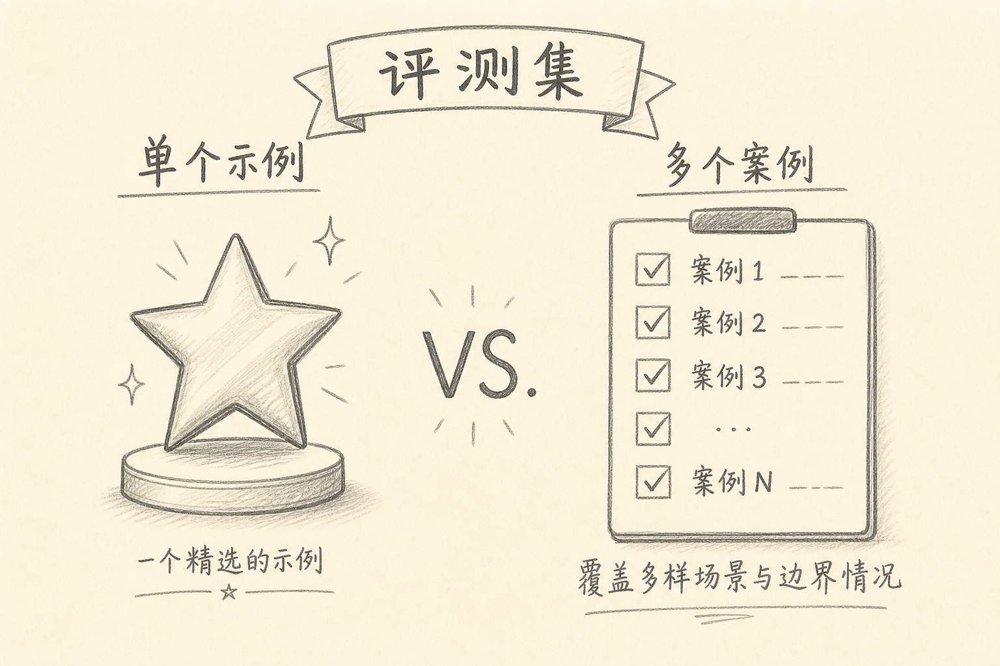
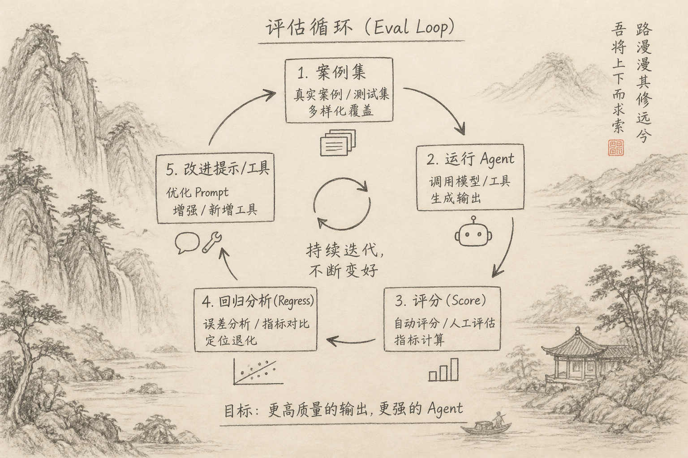

评测集（eval set）是一组固定的任务与验收标准，用来反复测量 Agent 或提示策略是否变好、变坏。

演示很会骗人：挑一个熟题，现场一次成功，不等于可上线。换个仓库、换个错误形态，就翻车。

## 一、先说一个具体麻烦

周五演示：Agent 修好了一个已知 bug，全场鼓掌。  
周一：同类 bug 换个文件名，它开始乱改无关模块。

你不知道是模型更新、提示改动，还是运气。没有评测集，就没有回归。

## 二、评测集解决什么问题

（1）**可重复**：同一套题，多次跑，看通过率  
（2）**可比较**：换模型、换提示、换工具，有对照  
（3）**可回归**：改动后是否弄坏旧能力  
（4）**对抗演示偏见**：逼你收录「难看但真实」的题

它不解决产品方向对不对，但解决「手感」无法复述的问题。

## 三、最小评测集长什么样

每条用例至少包含：

（1）输入：仓库切片或问题描述  
（2）允许工具与范围  
（3）验收：命令、断言、禁止改动的路径  
（4）标签：简单 / 工具失败 / 长上下文 等

起步不必上百条。**20 条真实丑题**，往往比 200 条合成题有用。

分类建议覆盖：

（A）只读问答  
（B）单文件修改  
（C）多文件修改  
（D）工具报错恢复  
（E）故意缺信息（应追问而不是瞎改）

## 四、怎么跑、怎么看

（1）固定模型与工具版本，记录下来  
（2）自动跑能自动的验收；人工只审难自动项  
（3）看通过率、平均步数/费用、是否越权改文件  
（4）改提示或工具后，必须重跑全量或烟雾子集

演示可以继续做；演示成功后，把该题收入评测集，才算沉淀。

## 五、常见误区

（1）**只收会做的题**  
分数虚高。  
（2）**验收只写「看起来对」**  
无法回归。  
（3）**每次手工点点点**  
坚持不了三周。  
（4）**用公开竞赛榜替代自家业务题**  
域不匹配。

## 六、小结与专栏收束

评测集把 Agent 从「表演」拉回「工程」。先有可重复的丑题与验收，再谈换模型与加工具。

「Agent 工程笔记」三篇主线：失败分层 → 上下文取舍 → 评测回归。之后加能力，都先问：评测过了吗？

（完）
